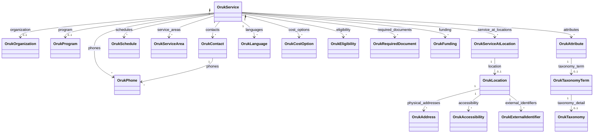

# OrukModels

Core class library providing C# model types for Open Referral UK (ORUK) v3 / HSDS v3.0 data.

## Purpose

This library defines the entity model used to deserialise ORUK v3 API responses and serve as
the input to all transformation pipelines (Schema.org, FHIR, MCP).  It has no dependencies on
ASP.NET Core or any HTTP framework, and is intentionally thin — pure model classes only.

## Design Principles

- **Receive liberally:** All optional ORUK fields are nullable (`string?`, `int?`, etc.).
  Missing fields are tolerated during deserialisation; no exceptions are thrown for absent values.
- **EF-ready:** Entity model types use `class` with mutable `{ get; set; }` properties and `virtual`
  navigation properties to support future Entity Framework Core integration without a schema migration.
  Primary keys use `string` rather than `Guid`.
- **Pure value objects use `record`:** Immutable response wrappers and feed extension types
  (e.g. `OrukPage<T>`, `OrukPcMetadata`) use `record` with `{ get; init; }` properties.
- **System.Text.Json:** All JSON mapping uses `[JsonPropertyName]` attributes.
  `Newtonsoft.Json` is not used.

## Entity Model



## Models

| Class | ORUK entity | Notes |
|-------|-------------|-------|
| `OrukPage<T>` | Paged response wrapper | Record type; wraps `contents[]` |
| `OrukService` | `service` | Core service entity |
| `OrukOrganization` | `organization` | Legal entity delivering services |
| `OrukLocation` | `location` | Physical address / geographic point |
| `OrukAddress` | `address` | Postal or physical address |
| `OrukContact` | `contact` | Contact details for a service/org/location |
| `OrukPhone` | `phone` | Telephone number |
| `OrukSchedule` | `schedule` | Opening hours; supports RFC 5545 recurrence |
| `OrukServiceAtLocation` | `service_at_location` | Service–location join entity |
| `OrukServiceArea` | `service_area` | Geographic coverage (ONS codes) |
| `OrukCostOption` | `cost_option` | Pricing / fee information |
| `OrukEligibility` | `eligibility` | Access criteria |
| `OrukLanguage` | `language` | Language spoken at service/location |
| `OrukTaxonomyTerm` | `taxonomy_term` | Classification term |
| `OrukTaxonomy` | `taxonomy` | Classification scheme |
| `OrukAttribute` | `attribute` | Link between entity and taxonomy term |
| `OrukRequiredDocument` | `required_document` | Document required to access a service |
| `OrukFunding` | `funding` | Funding source |
| `OrukProgram` | `program` | Programme grouping services |
| `OrukAccessibility` | `accessibility` | Accessibility feature at a location |
| `OrukExternalIdentifier` | `external_identifier` | UPRN, USRN, etc. |
| `OrukMetadata` | `metadata` | Change audit trail |
| `OrukPcMetadata` | `pc_metadata` | Bristol OPD extension (non-standard) |
| `OrukPcTargetAudience` | `pc_targetAudience` | Bristol OPD extension (non-standard) |

## Usage

```csharp
using System.Text.Json;
using OrukModels.Models;

var options = new JsonSerializerOptions { PropertyNameCaseInsensitive = true };

// Deserialise a paged ORUK response
var page = JsonSerializer.Deserialize<OrukPage<OrukService>>(json, options);

// Deserialise a single service
var service = JsonSerializer.Deserialize<OrukService>(json, options);
```

## Maintenance

> **README maintenance:** This `README.md` must be updated whenever a new model class is added,
> an existing class changes significantly, or the design principles are revised.
