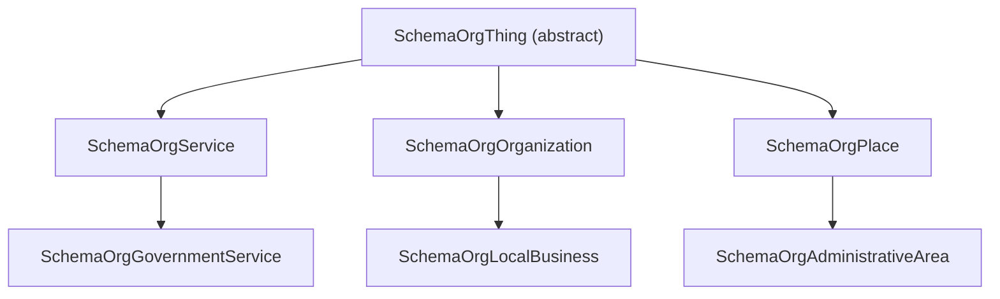

# OrukModels/SchemaOrg — Schema.org Output Models

This directory contains C# record types that model the **Schema.org JSON-LD** representation of a service directory.  These are **output types**: they are constructed by the transformer layer and serialised to produce the `@graph` of a JSON-LD document.

## Purpose

Search engines (Google, Bing) and AI agents consume Schema.org structured data to understand and index service-directory content.  By expressing ORUK service data as Schema.org JSON-LD we enable:

- Google rich results for `GovernmentService` and `LocalBusiness`
- AI/LLM discoverability via JSON-LD context
- Linked-data cross-referencing via `@id` URIs

## Type Hierarchy



Supporting types (standalone records, no inheritance from `SchemaOrgThing`):

| Type | Schema.org type | Maps from ORUK |
|------|-----------------|----------------|
| `SchemaOrgPostalAddress` | `PostalAddress` | `Address` |
| `SchemaOrgGeoCoordinates` | `GeoCoordinates` | `Location.latitude/longitude` |
| `SchemaOrgContactPoint` | `ContactPoint` | `Contact` |
| `SchemaOrgOffer` | `Offer` | `CostOption` |
| `SchemaOrgOpeningHoursSpecification` | `OpeningHoursSpecification` | `Schedule` |
| `SchemaOrgAudience` | `Audience` | `Eligibility` |
| `SchemaOrgPeopleAudience` | `PeopleAudience` | `Eligibility` (age-based) |
| `SchemaOrgServiceChannel` | `ServiceChannel` | Contact/URL access methods |
| `SchemaOrgPropertyValue` | `PropertyValue` | `additionalProperty` values |
| `SchemaOrgLocationFeatureSpecification` | `LocationFeatureSpecification` | `Accessibility` |
| `SchemaOrgDefinedTerm` | `DefinedTerm` | `TaxonomyTerm` (with URI) |
| `SchemaOrgImageObject` | `ImageObject` | `Organization.logo` |
| `SchemaOrgLanguage` | `Language` | `Language` |
| `SchemaOrgEducationalOccupationalCredential` | `EducationalOccupationalCredential` | `Service.accreditations` |

## Mandatory Vocabularies

Schema.org defines `DayOfWeek` as a required enumeration.  Always use the constants in `SchemaDayOfWeek` for `OpeningHoursSpecification.DayOfWeek` — free-text day names are not valid:

```csharp
using OrukModels.SchemaOrg;

var spec = new SchemaOrgOpeningHoursSpecification
{
    DayOfWeek = SchemaDayOfWeek.Monday,
    Opens = "09:00",
    Closes = "17:00"
};
```

## Mandatory Properties

The following properties are enforced by the C# `required` modifier:

| Type | Required property | Reason |
|------|-------------------|--------|
| `SchemaOrgGeoCoordinates` | `Latitude`, `Longitude` | Coordinates are meaningless without both values |
| `SchemaOrgOffer` | `Price`, `PriceCurrency` | Required by Google Structured Data |
| `SchemaOrgPropertyValue` | `Name`, `Value` | A property-value pair needs both |

`Name` on `SchemaOrgService` / `SchemaOrgGovernmentService` / `SchemaOrgOrganization` is inherited as `string?` from `SchemaOrgThing`.  It is **strongly recommended** (required by Google rich results) — always set it.

## Polymorphic Serialisation

`SchemaOrgThing` uses `[JsonPolymorphic]` so that a `IReadOnlyList<SchemaOrgThing>` graph serialises each element with its correct `@type` discriminator.  Use `SchemaOrgSerializerOptions.Default` when calling `JsonSerializer.Serialize`:

```csharp
var doc = new SchemaOrgDocument
{
    Graph =
    [
        new SchemaOrgGovernmentService { Name = "My Service", Id = "https://example.gov.uk/services/123" },
        new SchemaOrgOrganization { Name = "My Organisation", Id = "https://example.gov.uk/orgs/456" }
    ]
};

string json = JsonSerializer.Serialize(doc, SchemaOrgSerializerOptions.Default);
```

## Serialisation Output

The output follows the JSON-LD `@graph` pattern described in [`../../../../plan/mapping.md`](../../../../plan/mapping.md).

## Adding New Types

1. Add a new `record` in this directory.
2. If the type belongs in the `@graph` (i.e. it is a top-level node), add it as a `[JsonDerivedType]` on `SchemaOrgThing`.
3. Update this README.
