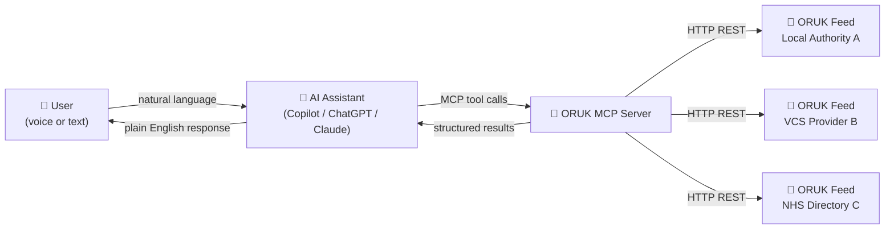
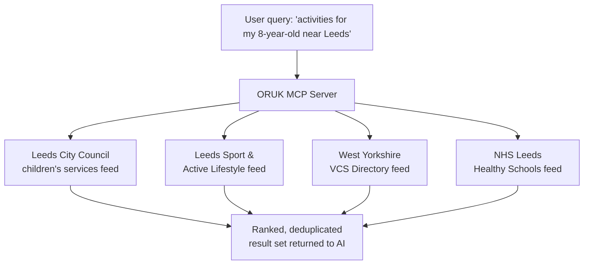

# MCP Server Concept – Open Referral UK

## What Is Model Context Protocol?

**Model Context Protocol (MCP)** is an open standard, originally published by Anthropic, that defines how AI assistants (the *client*) connect to external data sources and tools (the *server*).  Rather than training an AI on a static snapshot of data, MCP lets the AI call live, structured tools at query time — much like a browser calling a web API.

MCP servers are now supported by:

- **Anthropic Claude** (desktop and API)
- **Microsoft Copilot 365** (via Copilot Studio / Graph Connectors)
- **OpenAI ChatGPT** (via Custom GPT Actions and the Responses API with MCP support)
- Open-source agent frameworks (LangChain, AutoGen, LlamaIndex, etc.)

## How ORUK Data Fits

Open Referral UK (ORUK) publishes directories of local services — community groups, health services, social care, sports facilities, schools, voluntary organisations — as structured JSON feeds.  These feeds already describe *who* provides a service, *what* it offers, *where* it is, *when* it runs, and *who* it is for.

An MCP server wraps one or more ORUK feeds and exposes that data as **callable tools** that an AI assistant can invoke on behalf of a user.

The AI never directly handles raw ORUK JSON.  The MCP server does the querying, filtering, pagination, and ranking — returning only the relevant subset to the AI, which then composes a natural language answer.

---

## MCP Tools Exposed

The server would expose a set of **tools** (functions the AI can call).  Each tool has a name, a description the AI uses to decide when to call it, and typed parameters.

| Tool | Purpose | Key Parameters |
|------|---------|----------------|
| `search_services` | Full-text + proximity search across all feeds | `query`, `location`, `radius_km`, `max_results` |
| `filter_services` | Narrow results by structured criteria | `taxonomy_term`, `minimum_age`, `maximum_age`, `free_only`, `accessibility_needs` |
| `get_service_detail` | Retrieve the full record for one service | `service_id` |
| `list_taxonomies` | Return the ORUK taxonomy tree (categories / need types) | `parent_term` |
| `get_opening_times` | Return current and upcoming opening slots | `service_id`, `from_date` |
| `check_eligibility` | Ask whether a service matches stated criteria | `service_id`, `age`, `need_type`, `postcode` |
| `list_services_by_organisation` | All services run by a named provider | `organisation_id` |
| `get_accessibility_info` | Physical access, BSL, easy-read availability | `service_id` |

---

## Capability Model

### 1. Natural Language Service Discovery

A user can describe a need in plain English — including imprecise or colloquial language — and the AI interprets intent before calling `search_services`.

> *"Somewhere my toddler can run around indoors when it's raining"*
> → searches taxonomy: `children's activities`, `indoor play`

The AI handles synonyms, local dialect, and ambiguity that a traditional search box cannot.

### 2. Location-Aware Results

The AI can request the user's location (or infer it from context such as a postcode mentioned earlier in the conversation) and pass it to `search_services` with a radius.  Results are returned sorted by distance.  The user never has to navigate a map interface.

### 3. Multi-Criteria Filtering

After an initial set of results, the user can progressively refine:

> *"Only free ones"* → AI adds `free_only: true`
> *"That are accessible by wheelchair"* → AI adds `accessibility_needs: wheelchair`
> *"Open on Saturday mornings"* → AI calls `get_opening_times` to filter

Each refinement is a new MCP tool call; the user experiences it as a natural conversation.

### 4. Eligibility Checking

Many services have age restrictions, residency requirements, or referral criteria.  The `check_eligibility` tool lets the AI confirm, before recommending a service, whether a particular user is likely to qualify — reducing frustration and wasted journeys.

### 5. Multi-Feed Aggregation

A single ORUK MCP server can aggregate feeds from multiple providers simultaneously: a local authority, an NHS trust directory, a voluntary sector network, and a leisure trust may all publish ORUK feeds.  From the user's perspective there is one seamless search, not four separate websites to visit.

### 6. Conversational Follow-Up

Because MCP preserves context across a conversation turn, the AI can handle follow-up questions without the user repeating themselves:

> Turn 1: *"Find me swimming lessons for my 6-year-old in Bristol"*
> Turn 2: *"Which of those are on a weekday evening?"*
> Turn 3: *"How do I book the Horfield Leisure Centre one?"*

Each turn calls different tools (`search_services` → `get_opening_times` → `get_service_detail`) against the same implicit subject.

### 7. Proactive Suggestions

An agentic AI can use the MCP server reactively (answering direct questions) **and** proactively (surfacing relevant services based on context gathered elsewhere in the conversation).  For example, if a user mentions they are a new parent in passing, Copilot 365 might proactively suggest relevant local children's centres, health visitor services, or benefit entitlements.

### 8. Integration with Other Copilot / Agent Capabilities

Because the MCP server is one tool among many available to the AI, it can be combined with other capabilities in a single agent workflow:

| Combination | Example |
|-------------|---------|
| MCP + Calendar | Find a swimming club with a slot that fits the user's existing commitments |
| MCP + Maps | Show a walking route to the recommended service |
| MCP + Email | Draft a referral email to a social care service on the user's behalf |
| MCP + Translation | Return service details in the user's preferred language |
| MCP + Document generation | Produce a printed care plan that includes recommended local services |

### 9. Accessibility and Inclusion

Natural language interfaces lower the barrier for users who:

- Have low digital literacy or are uncomfortable with websites
- Are using screen readers or voice interfaces
- Have cognitive difficulties that make form-based search hard
- Are in a stressful situation (carer crisis, new diagnosis) and cannot afford to fail at navigating a directory

The AI absorbs the complexity of the ORUK data model; the user simply talks or types naturally.

### 10. Professional / Caseworker Use

Beyond individual citizens, professionals — social workers, GPs, school SENCOs, Citizens Advice advisers — can use an MCP-enabled Copilot to rapidly identify appropriate services for clients, supporting statutory assessment and care planning workflows without leaving their existing tooling.

---

## Boundaries and Limitations

| What the MCP server does | What it does not do |
|--------------------------|---------------------|
| Queries live ORUK data feeds | Make bookings or referrals on behalf of the user |
| Returns structured service information | Guarantee service availability or waiting times |
| Checks stated eligibility criteria | Make clinical or legal eligibility decisions |
| Aggregates multiple feeds | Create or edit service records |
| Provides contact details | Provide medical advice or crisis support |

> **Important:** The AI should always signpost users to emergency services (999, 111, Samaritans) or crisis pathways when there are indicators of immediate risk.  An MCP server for local services is a discovery tool, not a crisis intervention system.
