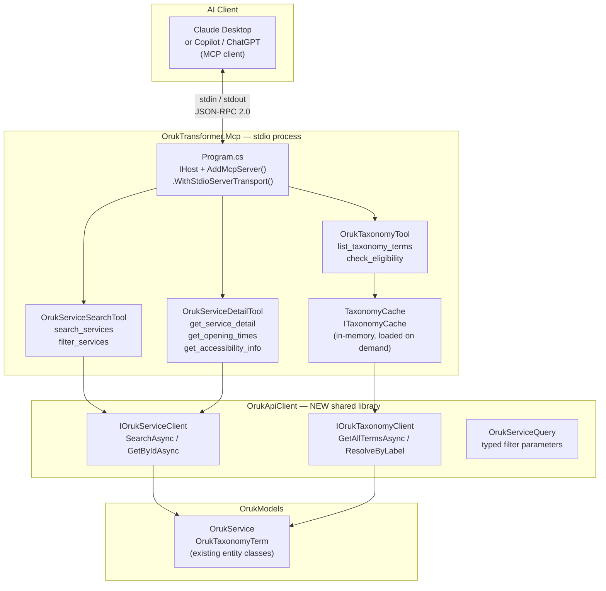
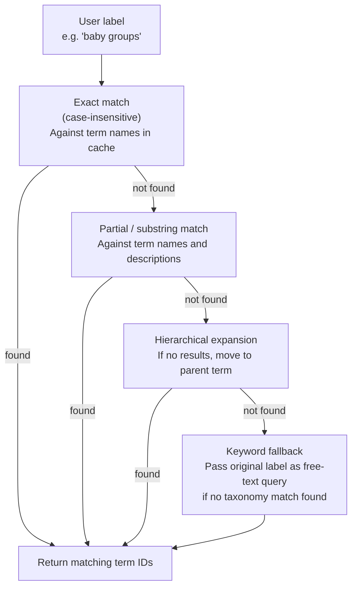
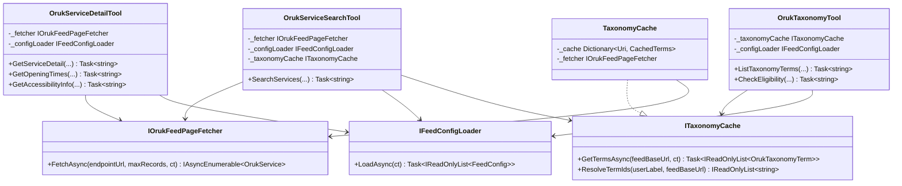
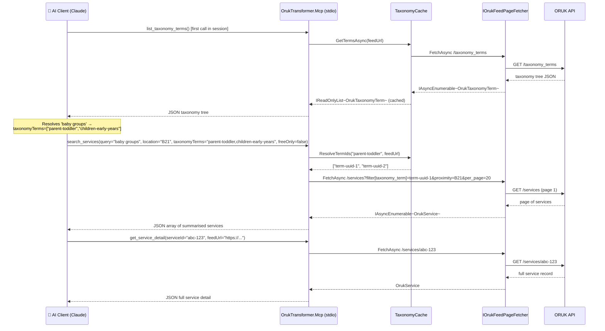
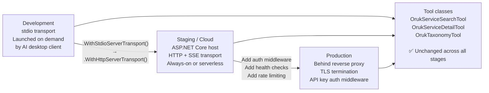

# MCP Server Design – C# Implementation Approach

## Overview

This document describes the technical design for `OrukTransformer.Mcp` — a C# MCP server that exposes Open Referral UK service data to AI agents (Claude, Copilot, ChatGPT) as callable tools.

The server is designed to:

- Run as a **stdio process** during development (launched on demand by the AI client, no daemon required)
- Be wrapped in an **ASP.NET Core web service** for production deployment, with no logic changes
- Reuse the existing `OrukTransformer.Core` and `OrukTransformer.Cli` infrastructure for ORUK data access
- Be registered in the solution alongside the other projects

---

## Placement in the Solution

```
src/
├── OrukTransformer.Core/          # Transformation logic (existing)
├── OrukTransformer.Cli/           # CLI host + ORUK feed fetcher (existing)
├── OrukTransformer.Core.Tests/    # (existing)
├── OrukTransformer.Cli.Tests/     # (existing)
└── OrukTransformer.Mcp/           # ← NEW: MCP server host
    ├── OrukTransformer.Mcp.csproj
    ├── Program.cs                 # Host wiring only
    ├── Tools/
    │   ├── OrukServiceSearchTool.cs
    │   ├── OrukServiceDetailTool.cs
    │   └── OrukTaxonomyTool.cs
    ├── Taxonomy/
    │   ├── ITaxonomyCache.cs
    │   └── TaxonomyCache.cs
    └── README.md
```

> **Note on the ORUK fetch layer:** The `OrukTransformer.Mcp` project does **not** reference `OrukTransformer.Cli`.  Instead, a new dedicated `OrukApiClient` library provides the typed query client (`IOrukServiceClient`, `IOrukTaxonomyClient`, `OrukServiceQuery`) that both the CLI and MCP hosts share.  See [oruk-api-client-design.md](oruk-api-client-design.md) for the full rationale and interface designs.  The existing `IOrukFeedPageFetcher` in `OrukTransformer.Cli` is superseded by `IOrukServiceClient` as part of this work.

---

## The MCP .NET SDK

The official .NET MCP SDK is published on NuGet as `ModelContextProtocol` (maintained under the `modelcontextprotocol` GitHub organisation, with Microsoft collaboration).  It provides:

| Component | Purpose |
|-----------|---------|
| `IHost` + `AddMcpServer()` | .NET Generic Host integration |
| `WithStdioServerTransport()` | Reads JSON-RPC 2.0 messages from stdin, writes to stdout |
| `WithHttpServerTransport()` | ASP.NET Core SSE/HTTP transport (for web deployment) |
| `[McpServerToolType]` | Marks a class as containing MCP tools |
| `[McpServerTool]` | Marks a method as an MCP tool callable by the AI agent |
| `[Description(...)]` | Provides the description the AI reads to decide whether to call a tool |

The SDK handles all JSON-RPC framing, capability negotiation, and error marshalling — the project only needs to implement the tool methods.

---

## Component Architecture



---

## Transport Strategy

The `ModelContextProtocol` SDK abstracts transport behind `IServerTransport`.  The entry point switches on the environment:

```csharp
// Program.cs (sketch)
var builder = Host.CreateApplicationBuilder(args);

builder.Services
    .AddSingleton<ITaxonomyCache, TaxonomyCache>()
    .AddHttpClient()                          // IHttpClientFactory
    .AddSingleton<IOrukFeedPageFetcher, OrukFeedPageFetcher>()
    .AddSingleton<IFeedConfigLoader, FileFeedConfigLoader>()
    .AddMcpServer()
    .WithStdioServerTransport()               // ← dev / stdio mode
    .WithTools<OrukServiceSearchTool>()
    .WithTools<OrukServiceDetailTool>()
    .WithTools<OrukTaxonomyTool>();

await builder.Build().RunAsync();
```

When wrapping in a web service later, the single change is:

```csharp
// Web host variant (sketch — future)
.WithHttpServerTransport()   // replaces WithStdioServerTransport()
```

All tool classes remain unchanged.

### Why Stdio for Development

| Property | Stdio | HTTP/SSE |
|----------|-------|---------|
| Process lifecycle | Launched on demand by AI client; exits when client disconnects | Long-running server process required |
| No port conflicts | ✅ — no port binding | ⚠ — must manage port allocation |
| Auth required | ✅ — OS process isolation is sufficient | ⚠ — token / API key needed |
| Works offline | ✅ | ✅ (if server is local) |
| Suitable for CI | ✅ | Needs a running server or mock |
| AI client config | Simple path in `claude_desktop_config.json` | URL in client config |

---

## Tool Design

Each tool class is decorated with `[McpServerToolType]`.  Each tool method is decorated with `[McpServerTool]` and `[Description]`.  Parameters carry `[Description]` to guide the AI in choosing values.

### `OrukServiceSearchTool`

Responsible for the primary discovery query: full-text and taxonomy-filtered search across one or more ORUK feeds.

```csharp
// Design sketch — not full implementation
[McpServerToolType]
public sealed class OrukServiceSearchTool(
    IOrukFeedPageFetcher fetcher,
    IFeedConfigLoader configLoader,
    ITaxonomyCache taxonomyCache,
    ILogger<OrukServiceSearchTool> logger)
{
    [McpServerTool]
    [Description(
        "Search for local services in an Open Referral UK directory. " +
        "Use this when the user wants to find activities, support, or care services. " +
        "Returns a list of matching services with names, locations, and descriptions.")]
    public async Task<string> SearchServices(
        [Description("Natural language description of the service needed, e.g. 'baby groups', 'dementia day care', 'football for kids'")]
        string query,

        [Description("UK postcode or place name to search near, e.g. 'BS7', 'Handsworth Birmingham'")]
        string location,

        [Description("Search radius in kilometres. Default 5.")]
        int radiusKm = 5,

        [Description("Maximum number of results to return. Default 10.")]
        int maxResults = 10,

        [Description("Comma-separated taxonomy term names or IDs to filter by, e.g. 'Children and Early Years,Parent and Toddler Groups'. Leave empty for keyword-only search.")]
        string? taxonomyTerms = null,

        [Description("Only return free services. Default false.")]
        bool freeOnly = false,

        [Description("Only return services with wheelchair-accessible venues. Default false.")]
        bool accessibleOnly = false,

        CancellationToken cancellationToken = default)
    { /* implementation */ }
}
```

**Return shape:** A JSON string containing an array of summarised service objects — name, organisation, address, distance, cost indicator, short description, and service ID for follow-up calls.  The AI receives this as a structured string and composes its own prose response.

---

### `OrukServiceDetailTool`

Retrieves the full record for a single service identified by its ID from a previous search.

```csharp
[McpServerToolType]
public sealed class OrukServiceDetailTool(
    IOrukFeedPageFetcher fetcher,
    IFeedConfigLoader configLoader,
    ILogger<OrukServiceDetailTool> logger)
{
    [McpServerTool]
    [Description(
        "Get the full details of a specific service including contact details, " +
        "opening times, eligibility criteria, and how to refer or book.")]
    public async Task<string> GetServiceDetail(
        [Description("The service ID returned by search_services")]
        string serviceId,

        [Description("The ORUK feed URL the service was retrieved from")]
        string feedUrl,

        CancellationToken cancellationToken = default)
    { /* implementation */ }

    [McpServerTool]
    [Description(
        "Get the opening times and scheduled sessions for a specific service. " +
        "Useful when the user asks 'when is it open' or 'is there a session this week'.")]
    public async Task<string> GetOpeningTimes(
        [Description("The service ID returned by search_services")]
        string serviceId,

        [Description("The ORUK feed URL the service was retrieved from")]
        string feedUrl,

        [Description("ISO 8601 date to find sessions from, e.g. '2025-09-01'. Defaults to today.")]
        string? fromDate = null,

        CancellationToken cancellationToken = default)
    { /* implementation */ }

    [McpServerTool]
    [Description(
        "Get the accessibility information for a service venue, including wheelchair access, " +
        "hearing loops, BSL interpretation, and parking.")]
    public async Task<string> GetAccessibilityInfo(
        [Description("The service ID returned by search_services")]
        string serviceId,

        [Description("The ORUK feed URL the service was retrieved from")]
        string feedUrl,

        CancellationToken cancellationToken = default)
    { /* implementation */ }
}
```

---

### `OrukTaxonomyTool`

Provides the AI with the vocabulary of the endpoint so it can resolve user language to taxonomy terms before calling `SearchServices`.

```csharp
[McpServerToolType]
public sealed class OrukTaxonomyTool(
    ITaxonomyCache taxonomyCache,
    IFeedConfigLoader configLoader,
    ILogger<OrukTaxonomyTool> logger)
{
    [McpServerTool]
    [Description(
        "List the taxonomy terms available in the configured ORUK feeds. " +
        "Call this first when you need to map a user's description to structured categories " +
        "before calling search_services. Returns a tree of category names and IDs.")]
    public async Task<string> ListTaxonomyTerms(
        [Description("Optional parent term name or ID to retrieve only a subtree, e.g. 'Children and Families'. Leave empty for the full tree.")]
        string? parentTerm = null,

        CancellationToken cancellationToken = default)
    { /* implementation */ }

    [McpServerTool]
    [Description(
        "Check whether a specific service is likely to be accessible to a person " +
        "given their age, location, and stated need. Returns a plain-English eligibility summary.")]
    public async Task<string> CheckEligibility(
        [Description("The service ID to check")]
        string serviceId,

        [Description("The ORUK feed URL the service was retrieved from")]
        string feedUrl,

        [Description("Age of the person the service is for, e.g. 76")]
        int? age = null,

        [Description("UK postcode of the person, e.g. 'BS7 8QG'")]
        string? postcode = null,

        [Description("Comma-separated need descriptors, e.g. 'dementia,wheelchair'")]
        string? needTypes = null,

        CancellationToken cancellationToken = default)
    { /* implementation */ }
}
```

---

## Taxonomy Cache

The taxonomy tree for a feed rarely changes.  Loading it on every tool call would be wasteful.  `TaxonomyCache` fetches it once per feed URL and caches the result in memory with a configurable TTL.

```csharp
// Design sketch
public interface ITaxonomyCache
{
    /// Returns all taxonomy terms for the given feed, loading from the API if not yet cached.
    Task<IReadOnlyList<OrukTaxonomyTerm>> GetTermsAsync(
        Uri feedBaseUrl,
        CancellationToken cancellationToken = default);

    /// Resolves a user-supplied label or partial label to matching taxonomy term IDs.
    IReadOnlyList<string> ResolveTermIds(string userLabel, Uri feedBaseUrl);
}
```

### Taxonomy Resolution Strategy



---

## Key Interfaces



---

## Interaction Sequence



---

## Tool Return Format

All tools return a **JSON string** (the MCP `content[0].text` field).  The AI receives this as a structured document and composes its own prose response.  Using JSON rather than pre-formatted prose keeps the tools reusable across AI platforms regardless of their preferred response style.

### `search_services` return example

```json
{
  "feed": "https://bristol.openplace.directory/o/OpenReferralService/v3",
  "query": "baby groups",
  "results": [
    {
      "id": "svc-001",
      "name": "Bounce and Rhyme",
      "organisation": "Bishopston Library",
      "address": "Radnor Road, Horfield, BS7 8QG",
      "distance_km": 0.4,
      "description": "Weekly baby and toddler session with songs, rhymes and free play.",
      "cost": "Free",
      "next_session": "2025-09-10T10:00:00",
      "taxonomy_terms": ["Parent and Toddler Groups", "Children and Early Years"],
      "detail_url": "https://bristol.openplace.directory/o/OpenReferralService/v3/services/svc-001"
    }
  ],
  "total_found": 7,
  "truncated": true,
  "data_quality_note": "2 results omitted due to missing location data."
}
```

The `data_quality_note` field allows the MCP server to surface data gaps to the AI, which should relay them honestly to the user.

---

## Development Workflow

### 1. Build and Register with Claude Desktop

After building the project, register the executable in Claude Desktop's config file:

**`%APPDATA%\Claude\claude_desktop_config.json`** (Windows) or **`~/Library/Application Support/Claude/claude_desktop_config.json`** (macOS):

```json
{
  "mcpServers": {
    "oruk": {
      "command": "dotnet",
      "args": [
        "run",
        "--project",
        "C:\\path\\to\\src\\OrukTransformer.Mcp\\OrukTransformer.Mcp.csproj"
      ],
      "env": {
        "ORUK_FEEDS_FILE": "C:\\path\\to\\feeds.json"
      }
    }
  }
}
```

Claude Desktop launches the process on demand and communicates over stdin/stdout.  The process exits when Claude is closed.

### 2. Test with MCP Inspector

The MCP Inspector (`npx @modelcontextprotocol/inspector`) is the standard development tool for testing MCP servers interactively without an AI client:

```
npx @modelcontextprotocol/inspector dotnet run --project src/OrukTransformer.Mcp
```

This opens a browser UI where individual tools can be called with test parameters and the JSON response inspected.

### 3. Automated Testing

Tool methods are plain C# methods and can be unit-tested directly, independently of the MCP transport.  Inject a mock `IOrukFeedPageFetcher` returning fixture data (already used in `OrukTransformer.Core.Tests`) and assert that the JSON output string is well-formed and contains expected fields.

```
src/OrukTransformer.Mcp.Tests/
├── Tools/
│   ├── OrukServiceSearchToolTests.cs
│   ├── OrukServiceDetailToolTests.cs
│   └── OrukTaxonomyToolTests.cs
└── Taxonomy/
    └── TaxonomyCacheTests.cs
```

---

## Project File (`.csproj`) Sketch

```xml
<Project Sdk="Microsoft.NET.Sdk">
  <PropertyGroup>
    <OutputType>Exe</OutputType>
    <TargetFramework>net10.0</TargetFramework>
    <ImplicitUsings>enable</ImplicitUsings>
    <Nullable>enable</Nullable>
    <AssemblyName>oruk-mcp</AssemblyName>
    <RootNamespace>OrukTransformer.Mcp</RootNamespace>
  </PropertyGroup>

  <ItemGroup>
    <PackageReference Include="ModelContextProtocol" Version="0.3.*" />
    <PackageReference Include="Microsoft.Extensions.Hosting" Version="10.*" />
    <PackageReference Include="Microsoft.Extensions.Http" Version="10.*" />
    <PackageReference Include="Microsoft.Extensions.Logging.Console" Version="10.*" />
  </ItemGroup>

  <ItemGroup>
    <ProjectReference Include="..\..\code\OrukModels\OrukModels.csproj" />
    <ProjectReference Include="..\OrukApiClient\OrukApiClient.csproj" />
    <ProjectReference Include="..\OrukTransformer.Core\OrukTransformer.Core.csproj" />
  </ItemGroup>
</Project>
```

> The `OrukTransformer.Cli` project reference is removed here — the `OrukApiClient` library replaces `IOrukFeedPageFetcher` as the shared data-access layer.  `OrukTransformer.Core` is referenced only if the MCP server needs to produce Schema.org output (not required for the initial query-focused implementation).

---

## Path to HTTP / HTTPS Wrapping

The stdio design is a stepping stone.  Evolving to a web-hosted MCP server requires only changes to `Program.cs`:



| Concern | Stdio | HTTP |
|---------|-------|------|
| Transport line | `.WithStdioServerTransport()` | `.WithHttpServerTransport()` |
| Hosting | Console app / `dotnet run` | ASP.NET Core or Azure Function |
| Auth | OS process isolation | Bearer token / API key middleware |
| Logging | stderr (not stdout — MCP owns stdout) | Structured logs to Application Insights / Console |
| Scaling | One process per AI client session | Standard web service scaling |

---

## Configuration

The MCP server reads configuration from the same sources as the rest of the solution:

| Source | Content |
|--------|---------|
| `feeds.json` | List of ORUK endpoint URLs to query |
| `appsettings.json` | HTTP timeout, max results per query, taxonomy cache TTL |
| Environment variables | Override any setting; used in CI and cloud deployment |

```json
// appsettings.json (MCP-specific section)
{
  "Mcp": {
    "MaxResultsPerQuery": 20,
    "SearchRadiusDefaultKm": 5,
    "TaxonomyCacheTtlMinutes": 60,
    "HttpTimeoutSeconds": 30
  }
}
```
