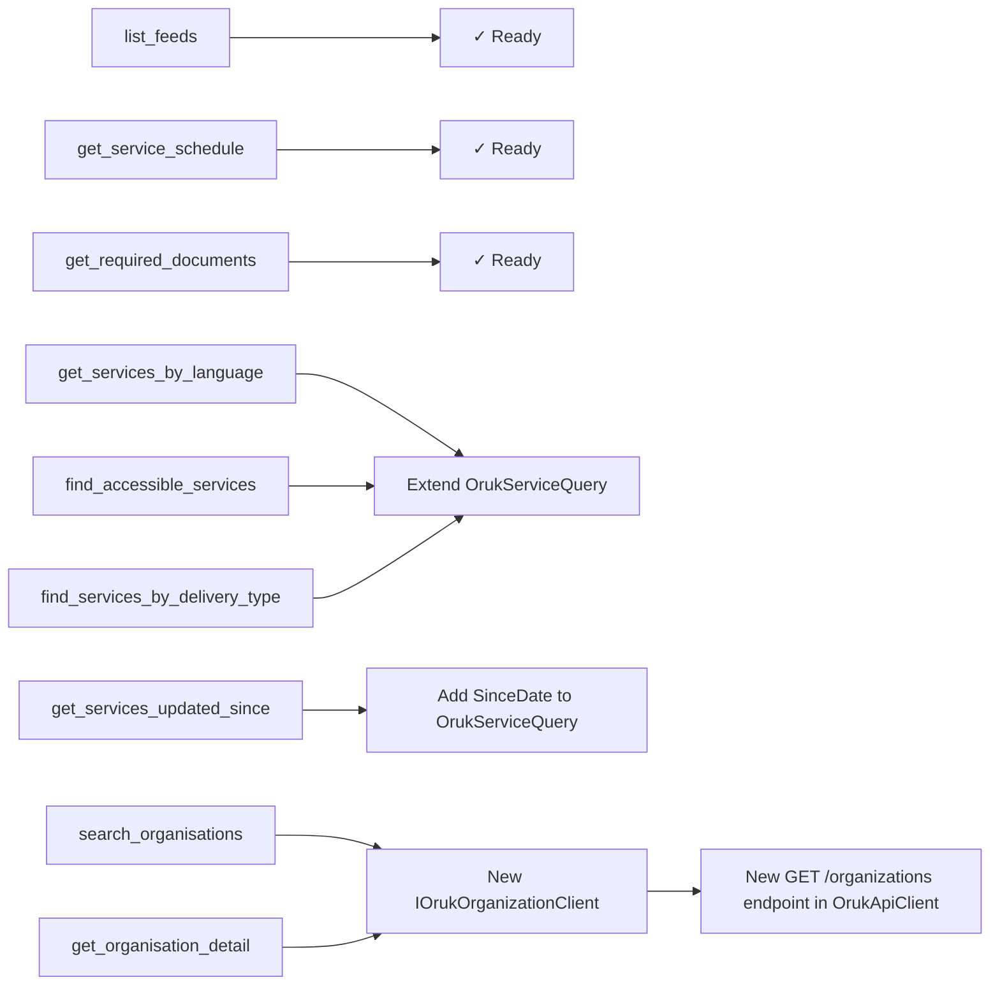

# MCP Tools Roadmap

## Current Tools (v0.1 — MVP)

| Tool | ORUK Entity / Endpoint | Description |
|------|----------------------|-------------|
| `search_services` | `GET /services` | Keyword + taxonomy + age + cost + proximity search across all configured feeds |
| `get_service_detail` | `GET /services/{id}` | Full service record including locations, opening times, eligibility, cost, accessibility |
| `list_taxonomy_terms` | `GET /taxonomy_terms` | Browse taxonomy categories available in a feed |
| `resolve_taxonomy_label` | `GET /taxonomy_terms` (cached) | Map a plain-language phrase to ORUK taxonomy term IDs |

---

## Gap Analysis

The ORUK v3 / HSDS data model contains the following entities that are either **not exposed** as MCP tools or are only partially reachable via `get_service_detail`:

| Entity | Model Class | Current Exposure | Gap |
|--------|-------------|-----------------|-----|
| Organisation | `OrukOrganization` | Embedded in service detail only | No search or detail tool |
| Location | `OrukLocation` | Embedded in service detail only | No proximity-only or type filter |
| Schedule | `OrukSchedule` | Embedded in service detail only | Agent must parse full detail to answer "when is this open?" |
| ServiceArea | `OrukServiceArea` | Not exposed | No tool to discover geographic coverage |
| RequiredDocument | `OrukRequiredDocument` | Not exposed | Agent cannot answer "what do I need to bring?" |
| Language | `OrukLanguage` | Not exposed | No filter for services in Welsh/Polish/BSL etc. |
| Accessibility | `OrukAccessibility` | Embedded in service detail only | No filter for wheelchair access, hearing loops etc. |
| CostOption | `OrukCostOption` | Partially exposed in `search_services` (free-only flag) | No structured cost comparison |
| Feed metadata | (config) | Not exposed | Agent does not know what data sources are active |

Additionally, `search_services` lacks filters for:
- Service **delivery type** (physical / virtual / postal) — `OrukLocation.LocationType`
- **Language** of service delivery — `OrukLanguage`
- **Accessibility** features — `OrukAccessibility.Description`
- **Last modified date** — `OrukService.LastModified`

---

## Proposed Tools by Phase

### Phase 1 — No new API client work required

These tools are built entirely from data already available via `IOrukServiceClient`.

#### `list_feeds`

**Purpose:** Return the list of configured ORUK data sources with identity information. Allows the AI agent to inform the user which directories are being searched and to make per-feed decisions.

**Agent usage examples:**
- "Which service directories are you searching?"
- "Is there a directory for South Gloucestershire?"

**Implementation:** Uses the injected `IReadOnlyList<Uri>` — no HTTP calls needed.

**Returns:**
```json
{
  "feed_count": 2,
  "feeds": [
    { "url": "https://bristol.openplace.directory/o/OpenReferralService/v3" },
    { "url": "https://bath.openplace.directory/o/OpenReferralService/v3" }
  ]
}
```

---

#### `get_service_schedule`

**Purpose:** Return the opening hours and availability schedule for a specific service without fetching the full service record. The agent calls this when the user's question is specifically about availability ("Is this open on Saturdays?", "What time does this service close?").

**Agent usage examples:**
- "When is the community food bank open?"
- "Does this service run at weekends?"
- "Is there an evening session?"

**Implementation:** Calls `IOrukServiceClient.GetByIdAsync`, then extracts and formats `OrukSchedule` records from both `Service.Schedules` and `ServiceAtLocations[].Schedules`. Interprets iCal fields (`freq`, `byday`, `opens_at`, `closes_at`) into human-readable form.

**Parameters:** `feed_url`, `service_id`

**Returns:** Structured schedule with human-readable days, times, and recurrence pattern.

---

#### `get_required_documents`

**Purpose:** Return what a service user needs to bring or provide to access a service. Answers the practical "what do I need?" question without the agent having to parse a full service record.

**Agent usage examples:**
- "What documents do I need to bring to register with this service?"
- "Do I need proof of address to access this food bank?"
- "What ID is required for this support group?"

**Implementation:** Calls `IOrukServiceClient.GetByIdAsync`, extracts `OrukRequiredDocument` collection plus any relevant text from `Service.ApplicationProcess` and `Service.EligibilityDescription`.

**Parameters:** `feed_url`, `service_id`

**Returns:** List of required documents plus application process notes.

---

### Phase 2 — Extend `OrukServiceQuery` with new client-side filters

These tools add filtering dimensions that are not currently supported. All filters are applied client-side after fetching from the ORUK endpoint (consistent with existing taxonomy/age/cost filtering).

#### `get_services_by_language`

**Purpose:** Find services delivered in a specific language. Critical for diverse UK communities — Polish, Welsh, Arabic, Somali, British Sign Language (BSL), etc.

**Agent usage examples:**
- "Find Polish-speaking support groups in Bristol"
- "Are there any services available in Welsh?"
- "My elderly parent speaks only Cantonese — what support is available?"

**New filter:** `OrukLanguage.Name` or `OrukLanguage.Code` (ISO 639) client-side match on `Service.Languages`.

---

#### `find_accessible_services`

**Purpose:** Filter services by accessibility feature at the delivery location. Essential for users with mobility, sensory, or cognitive impairments and for carers.

**Agent usage examples:**
- "Find wheelchair-accessible support groups near BS5"
- "Are there any services with a hearing loop for my deaf mother?"
- "My father uses a mobility scooter — which locations have accessible parking?"

**New filter:** `OrukAccessibility.Description` client-side substring/keyword match.

---

#### `find_services_by_delivery_type`

**Purpose:** Filter by how the service is delivered: in-person, online/virtual, or by post/telephone. Post-pandemic, many services are online-only and users need to be able to find them explicitly.

**Agent usage examples:**
- "Find online mental health support I can access from home"
- "My client can't travel — are there any phone or video services?"
- "Show me in-person services only — they don't have internet access"

**New filter:** `OrukLocation.LocationType` values: `physical`, `virtual`, `postal`.

---

### Phase 3 — Extend `OrukServiceQuery` with date filtering

#### `get_services_updated_since`

**Purpose:** Return services modified after a given date. Supports monitoring workflows ("What's changed this week?") and helps agents avoid recommending stale data.

**Agent usage examples:**
- "Have any new carer support services been added this month?"
- "Has the opening times information for this service been updated recently?"
- "Show me services that have been reviewed in the last 3 months"

**New filter:** `OrukService.LastModified` date comparison client-side.

---

### Phase 4 — New `IOrukOrganizationClient` (new API endpoint)

Requires adding `GET /organizations` and `GET /organizations/{id}` support to `OrukApiClient`.

#### `search_organisations`

**Purpose:** Search for the organisations (charities, councils, NHS bodies, community groups) that deliver services. Useful when the user wants to find a provider rather than a specific service.

**Agent usage examples:**
- "Which charities support people with dementia in Bristol?"
- "Find organisations that run foodbanks"
- "Is there an Age UK in my area?"

---

#### `get_organisation_detail`

**Purpose:** Full profile of an organisation including description, contact details, website, legal status, and all associated services.

**Agent usage examples:**
- "Tell me more about Bristol Mind"
- "What services does Carers Support Centre offer?"
- "How do I contact the organisation running this service?"

---

## Implementation Dependencies



## Build Order Summary

| Phase | Tools | New `OrukApiClient` work | Risk |
|-------|-------|--------------------------|------|
| 1 | `list_feeds`, `get_service_schedule`, `get_required_documents` | None | Low |
| 2 | `get_services_by_language`, `find_accessible_services`, `find_services_by_delivery_type` | Extend `OrukServiceQuery` + filter logic | Low |
| 3 | `get_services_updated_since` | Add `SinceDate` to query + filter | Low |
| 4 | `search_organisations`, `get_organisation_detail` | New `IOrukOrganizationClient` + `GET /organizations` | Medium |
