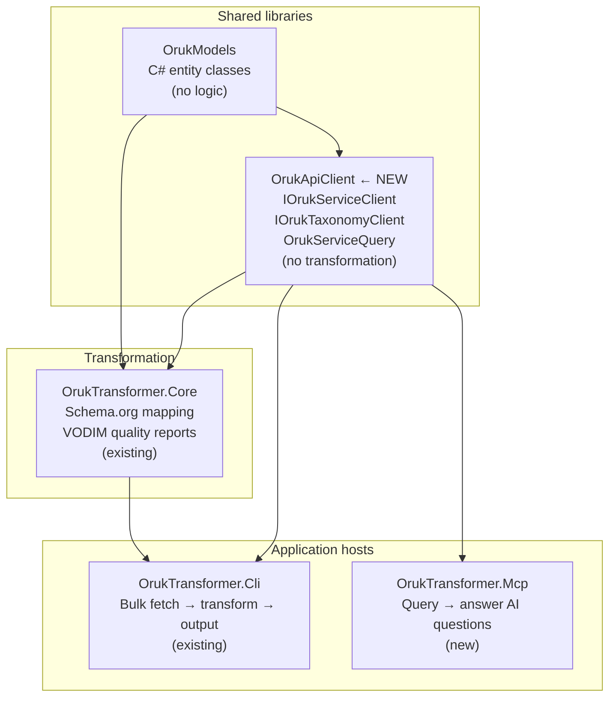
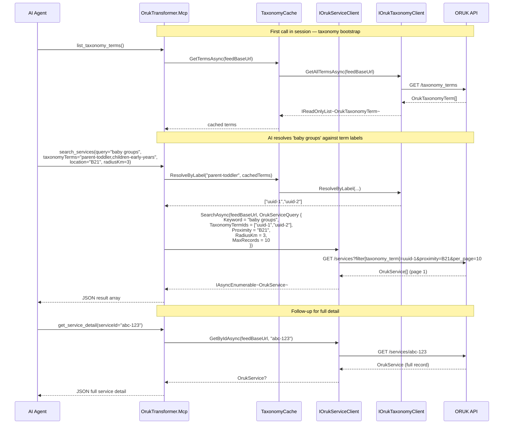
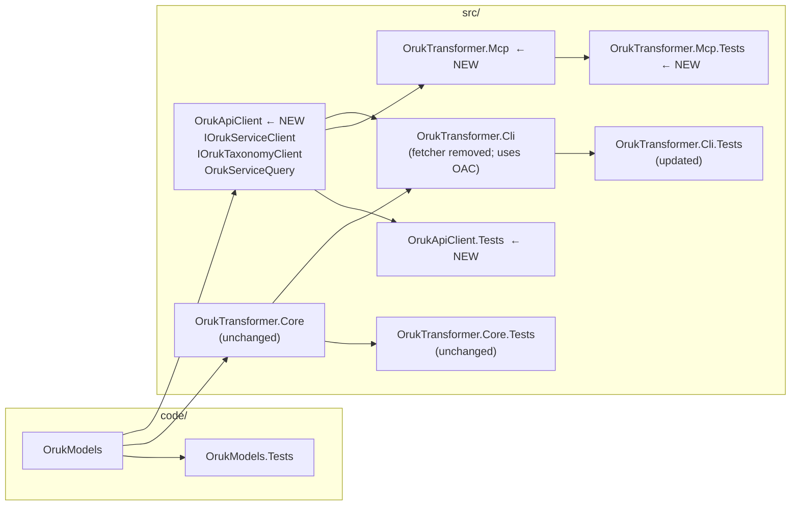

# ORUK API Client Design

## The Core Problem

The existing `IOrukFeedPageFetcher` was designed for one purpose: **bulk-fetch all services from a `/services` endpoint for transformation into Schema.org JSON-LD**.  Its signature reflects that:

```csharp
IAsyncEnumerable<OrukService> FetchAsync(Uri endpointUrl, int maxRecords, CancellationToken ct);
```

This is the right shape for the transformer CLI.  It is the wrong shape for the MCP server.

### What the MCP Server Actually Needs

| Need | Current fetcher | Gap |
|------|-----------------|-----|
| Filter by taxonomy term | ✗ — caller must bake params into `endpointUrl` | No typed query parameter |
| Filter by proximity / postcode | ✗ | No typed query parameter |
| Filter by age range | ✗ | No typed query parameter |
| Filter by cost (free only) | ✗ | No typed query parameter |
| Fetch a single service by ID | ✗ — fetches from `/services` paginated | No `GET /services/{id}` support |
| Fetch taxonomy terms | ✗ — hardcoded to `OrukService` | Different endpoint, different return type |
| Fetch organisations | ✗ | Different endpoint, different return type |
| Stop after first page | ✗ — always paginates | No per-query page-limit control distinct from record limit |
| Understand query scope | ✗ — one flat `Uri` in | No concept of base URL vs filter params |

The fetcher's internals (pagination, error handling, fallback deserialisation) are solid and reusable.  **The interface contract is what needs to change** — and those changes belong in a dedicated library, not inside `OrukTransformer.Core`.

---

## Why a Separate Library?

`OrukTransformer.Core` is a **transformation** library.  Its job is mapping ORUK data structures to Schema.org types.  It knows about vocabulary registries, VODIM quality scoring, and JSON-LD graph building.

`OrukTransformer.Mcp` is a **query** layer.  Its job is answering questions about live ORUK data.  It has no interest in Schema.org or VODIM.

Putting a rich ORUK query client into `OrukTransformer.Core` would couple query concerns to transformation concerns.  A cleaner split is:



`OrukTransformer.Cli` currently uses `OrukFeedPageFetcher` directly.  After the refactor, it references `OrukApiClient` and uses `IOrukServiceClient`.  Its transformation logic in `OrukTransformer.Core` is unchanged.

---

## Proposed: `src/OrukApiClient/`

A focused class library with no dependencies outside of `OrukModels`, `Microsoft.Extensions.Http`, and `Microsoft.Extensions.Logging`.  No ASP.NET Core.  No transformation libraries.

### Project file sketch

```xml
<Project Sdk="Microsoft.NET.Sdk">
  <PropertyGroup>
    <TargetFramework>net10.0</TargetFramework>
    <ImplicitUsings>enable</ImplicitUsings>
    <Nullable>enable</Nullable>
  </PropertyGroup>

  <ItemGroup>
    <PackageReference Include="Microsoft.Extensions.Http"    Version="10.*" />
    <PackageReference Include="Microsoft.Extensions.Logging.Abstractions" Version="10.*" />
  </ItemGroup>

  <ItemGroup>
    <ProjectReference Include="..\..\code\OrukModels\OrukModels.csproj" />
  </ItemGroup>
</Project>
```

### Folder structure

```
src/OrukApiClient/
├── OrukApiClient.csproj
├── README.md
├── IOrukServiceClient.cs
├── IOrukTaxonomyClient.cs
├── OrukServiceClient.cs         # migrated + extended from OrukFeedPageFetcher
├── OrukTaxonomyClient.cs
├── OrukServiceQuery.cs          # typed query parameter object
└── OrukQueryExtensions.cs       # Uri builder helpers (internal)
```

---

## `OrukServiceQuery` — Typed Query Parameters

Rather than having the caller concatenate query strings into a `Uri`, queries are expressed as a typed record:

```csharp
/// <summary>
/// Encapsulates the parameters for a filtered query against an ORUK v3 /services endpoint.
/// All filter properties are optional; omitted properties are not sent to the endpoint.
/// </summary>
public record OrukServiceQuery
{
    /// <summary>Free-text keyword search passed to the endpoint's text filter.</summary>
    public string? Keyword { get; init; }

    /// <summary>
    /// Taxonomy term IDs (UUIDs as returned by IOrukTaxonomyClient)
    /// to filter by. Multiple terms are OR-combined.
    /// </summary>
    public IReadOnlyList<string> TaxonomyTermIds { get; init; } = [];

    /// <summary>UK postcode or OS grid reference for proximity filtering.</summary>
    public string? Proximity { get; init; }

    /// <summary>Search radius in kilometres. Only applied when Proximity is set.</summary>
    public double? RadiusKm { get; init; }

    /// <summary>Minimum age of intended recipients.</summary>
    public double? MinimumAge { get; init; }

    /// <summary>Maximum age of intended recipients.</summary>
    public double? MaximumAge { get; init; }

    /// <summary>When true, restricts results to services with no cost.</summary>
    public bool? FreeOnly { get; init; }

    /// <summary>
    /// Maximum number of service records to return across all pages.
    /// A value less than 1 means no limit.
    /// </summary>
    public int MaxRecords { get; init; } = 20;
}
```

The `OrukQueryExtensions` helper (internal) converts an `OrukServiceQuery` into query string parameters that the ORUK v3 API understands — centralising all knowledge of the ORUK filtering syntax in one place.

---

## `IOrukServiceClient`

Replaces `IOrukFeedPageFetcher` for all callers.

```csharp
/// <summary>
/// Client for the ORUK v3 /services endpoint.
/// Handles pagination, query parameter construction, and "receive liberally" error tolerance.
/// </summary>
public interface IOrukServiceClient
{
    /// <summary>
    /// Search for services matching the given query.
    /// Paginates automatically; yields results as they arrive.
    /// </summary>
    IAsyncEnumerable<OrukService> SearchAsync(
        Uri feedBaseUrl,
        OrukServiceQuery query,
        CancellationToken cancellationToken = default);

    /// <summary>
    /// Fetch the full record for a single service by its ID.
    /// Returns null if the service does not exist or the endpoint returns 404.
    /// </summary>
    Task<OrukService?> GetByIdAsync(
        Uri feedBaseUrl,
        string serviceId,
        CancellationToken cancellationToken = default);
}
```

### Relationship to `IOrukFeedPageFetcher`

`IOrukFeedPageFetcher.FetchAsync(Uri endpointUrl, int maxRecords, ...)` becomes a special case of `IOrukServiceClient.SearchAsync` with an empty `OrukServiceQuery` and `MaxRecords` set.  The `OrukTransformer.Cli` bulk-fetch use case is still fully supported — callers just construct an `OrukServiceQuery { MaxRecords = 0 }` (no limit) with no filters.

The concrete `OrukServiceClient` **migrates the pagination and error-handling logic from `OrukFeedPageFetcher`** — that logic is good and should be preserved.  It is extended to:
1. Accept an `OrukServiceQuery` and build query string parameters from it before fetching
2. Support `GetByIdAsync` via `GET /services/{id}`

`IOrukFeedPageFetcher` and `OrukFeedPageFetcher` can be removed from `OrukTransformer.Cli` once `OrukTransformer.Cli` is updated to use `IOrukServiceClient`.

---

## `IOrukTaxonomyClient`

A new interface for the taxonomy endpoints — currently not fetched at all.

```csharp
/// <summary>
/// Client for the ORUK v3 /taxonomies and /taxonomy_terms endpoints.
/// </summary>
public interface IOrukTaxonomyClient
{
    /// <summary>
    /// Returns all taxonomy terms published by the feed,
    /// including parent–child relationships.
    /// </summary>
    Task<IReadOnlyList<OrukTaxonomyTerm>> GetAllTermsAsync(
        Uri feedBaseUrl,
        CancellationToken cancellationToken = default);

    /// <summary>
    /// Returns the direct children of the given parent term ID,
    /// or all root terms if parentId is null.
    /// </summary>
    Task<IReadOnlyList<OrukTaxonomyTerm>> GetChildTermsAsync(
        Uri feedBaseUrl,
        string? parentId,
        CancellationToken cancellationToken = default);

    /// <summary>
    /// Resolves a human-readable label to matching taxonomy term IDs using
    /// exact match, then partial match, then parent expansion.
    /// Returns an empty list if no match is found (keyword fallback is the caller's responsibility).
    /// </summary>
    IReadOnlyList<string> ResolveByLabel(
        string label,
        IReadOnlyList<OrukTaxonomyTerm> termCache);
}
```

`GetAllTermsAsync` calls `GET /taxonomy_terms` (paginated if needed).  `ResolveByLabel` is a pure in-memory operation operating over a pre-loaded term list — the taxonomy cache in `OrukTransformer.Mcp` calls `GetAllTermsAsync` once and passes the result to `ResolveByLabel` on each query.

---

## How the MCP Server Uses These Clients



---

## Handling Multiple Feeds

The MCP server's `search_services` tool queries **all feeds** in `feeds.json` and merges results.  `IOrukServiceClient.SearchAsync` is called once per feed URL; results are collected and ranked by distance before being returned to the AI.

```csharp
// Sketch of multi-feed fan-out inside OrukServiceSearchTool
var feeds = await _configLoader.LoadAsync(ct);

var perFeedResults = await Task.WhenAll(
    feeds.Select(feed =>
        _serviceClient
            .SearchAsync(feed.BaseUrl, query, ct)
            .Take(query.MaxRecords)
            .ToListAsync(ct)));

var merged = perFeedResults
    .SelectMany(r => r)
    .OrderBy(s => s.DistanceKm)   // where populated by feed
    .Take(query.MaxRecords)
    .ToList();
```

Each `OrukService` in the result must carry its source feed URL so that follow-up calls to `GetByIdAsync` know which endpoint to query.  This can be annotated by the client:

```csharp
// OrukServiceClient sets a feed-origin property on each returned service
// using the ExtensionData dictionary (or a wrapper record in the MCP layer)
```

A thin `ServiceWithOrigin` wrapper record in the MCP project keeps this concern out of `OrukModels`:

```csharp
// Internal to OrukTransformer.Mcp
internal record ServiceWithOrigin(OrukService Service, Uri FeedBaseUrl);
```

---

## Impact on Existing Projects

### `OrukTransformer.Cli`

| Item | Change |
|------|--------|
| `IOrukFeedPageFetcher` interface | **Remove** — replaced by `IOrukServiceClient` |
| `OrukFeedPageFetcher` class | **Migrate** pagination + error-handling logic → `OrukServiceClient` in `OrukApiClient` |
| `OrukTransformer.Cli.csproj` | Add `ProjectReference` to `OrukApiClient`; remove `Fetching/` folder |
| `RunCommand.cs` | Change dependency from `IOrukFeedPageFetcher` → `IOrukServiceClient`; construct `OrukServiceQuery { MaxRecords = maxRecords }` with no filters for bulk fetch |
| `Program.cs` | Register `IOrukServiceClient` / `OrukServiceClient` from DI |
| Existing tests for `OrukFeedPageFetcher` | **Migrate** to `OrukApiClient.Tests` project |

The transformation pipeline in `OrukTransformer.Core` is **unaffected** — it receives `OrukService` objects and does not care how they were fetched.

### `OrukTransformer.Core`

No changes required.  `OrukTransformer.Core` is a pure transformation library; it does not depend on the fetching layer.

### `OrukModels`

No changes required.  All ORUK entity types (`OrukService`, `OrukTaxonomyTerm`, etc.) are already defined here and are the shared currency across all layers.

---

## Solution Structure After Refactor



---

## Responsibility Summary

| Library | Knows about | Does not know about |
|---------|-------------|---------------------|
| `OrukModels` | ORUK entity shapes | HTTP, queries, transformation |
| `OrukApiClient` | ORUK API endpoints, pagination, query parameters, "receive liberally" HTTP handling | Schema.org, VODIM, MCP, AI |
| `OrukTransformer.Core` | Schema.org mapping, VODIM quality | HTTP, MCP, AI |
| `OrukTransformer.Cli` | CLI argument parsing, bulk-fetch orchestration, report writing | MCP, AI |
| `OrukTransformer.Mcp` | MCP tools, taxonomy caching, AI response formatting | Schema.org, VODIM |
