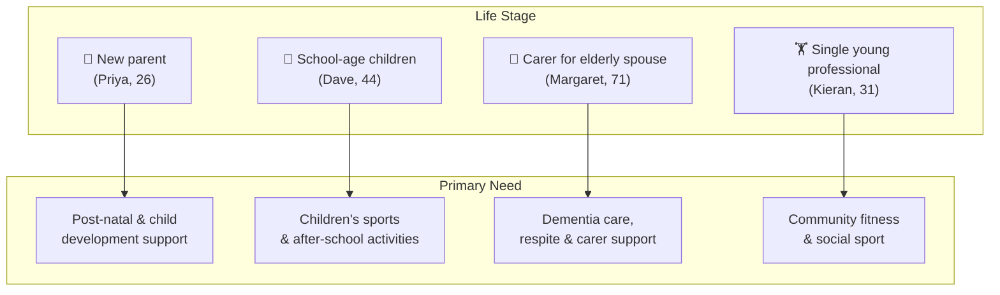

# Personas

The following personas represent a cross-section of UK residents who would benefit from AI-assisted access to Open Referral UK service data.  They are deliberately drawn from different life stages, geographies, cultural backgrounds and levels of digital confidence.

---

## Persona 1 – Priya Sharma

**"The Young First-Time Mum"**

| | |
|---|---|
| **Age** | 26 |
| **Location** | Handsworth, Birmingham (B21) |
| **Household** | Lives with her husband Raj (28, delivery driver) and their daughter Amara, aged 4 months |
| **Employment** | Maternity leave from her job as a dental receptionist |
| **Digital confidence** | High for social media and messaging; uses ChatGPT regularly on her phone |
| **Languages** | English (fluent), Punjabi (conversational) |

### Background

Priya grew up in Birmingham and has a good support network from her family, but this is her first child and she has found the transition to motherhood isolating.  Several of her close friends don't have children yet and she is keen to meet other new parents.  Raj works long shifts and is often unavailable during the day.  Priya is aware of health visitor services but is not sure what other support exists.  She uses the NHS App and WhatsApp groups but finds local council websites confusing to navigate.

### Goals

- Connect with other new parents through baby and toddler groups.
- Find affordable activities to stimulate Amara's development.
- Understand what post-natal wellbeing support is available.
- Plan her return to work and understand childcare options.

### Pain Points

- Council websites have multiple directories that don't join up.
- Many groups require booking in advance through platforms she doesn't know.
- She is unsure which services are still running post-pandemic.
- She doesn't always know the right terminology (e.g. "children's centre" vs "family hub").

---

## Persona 2 – Dave Morley

**"The Time-Poor Working Dad"**

| | |
|---|---|
| **Age** | 44 |
| **Location** | Beeston, Leeds (LS11) |
| **Household** | Lives with his partner Sharon and their children: Jayden (11) and Chloe (8) |
| **Employment** | Self-employed plumber; full-time, irregular hours |
| **Digital confidence** | Moderate; uses his phone for work apps and Google but finds AI tools unfamiliar |
| **Languages** | English |

### Background

Dave is from Leeds and has lived in Beeston his whole life.  He and Sharon are keen for the kids to have structured activities outside school — partly for their development and partly to help manage busy evenings.  Jayden is interested in football and gaming; Chloe enjoys swimming and gymnastics.  Dave coaches a junior Sunday league team but has no time to research other clubs and activities.  Sharon handles most of the school admin and after-school scheduling.  The family budget is tight; free or subsidised activities matter.

### Goals

- Find sports clubs and activity sessions for children aged 8–12 in south Leeds.
- Understand what is subsidised or free through the council or Active Leeds schemes.
- Get information quickly, without spending time on multiple websites.

### Pain Points

- No single place to search for children's activities across leisure trusts, schools and VCS.
- Activities often appear full or out of date when he does find them.
- He struggles to remember which term a club runs in.
- He wants information on his phone in a few seconds, not after filling in a form.

---

## Persona 3 – Margaret Hughes

**"The Dedicated Carer"**

| | |
|---|---|
| **Age** | 71 |
| **Location** | Bishopston, Bristol (BS7) |
| **Household** | Lives with her husband Gerald (76), who was diagnosed with Alzheimer's disease three years ago |
| **Employment** | Retired secondary school English teacher |
| **Digital confidence** | Moderate; comfortable with email, tablet browsing, and video calls; new to AI assistants |
| **Languages** | English |

### Background

Margaret spent 30 years teaching and is articulate and determined, but she is exhausted.  She is Gerald's primary carer and provides care around the clock.  Their adult son lives in Edinburgh and visits when he can.  Margaret has had to reduce all outside commitments to manage Gerald's needs.  She is aware that she needs respite but feels guilty about "placing Gerald somewhere" even temporarily.  Her GP has mentioned carer support but she hasn't followed up because she doesn't know where to start.  She uses a tablet given to her by her son and has started experimenting with Claude AI after seeing it mentioned in a magazine.

### Goals

- Find local day care or activities for Gerald so she can have regular planned breaks.
- Locate carer support groups where she can meet others in similar situations.
- Understand transport options to get Gerald to and from services safely.
- Find dementia-friendly activities (singing, art) that Gerald might enjoy.

### Pain Points

- Bristol City Council's website is hard to navigate under pressure.
- Phone lines for social care have long waits; she has limited time when Gerald is settled.
- She is not sure whether services are means-tested or require a social care assessment.
- She is emotionally fatigued and finds repeated searching demoralising.

---

## Persona 4 – Kieran O'Brien

**"The Active New Arrival"**

| | |
|---|---|
| **Age** | 31 |
| **Location** | Ancoats, Manchester (M4) |
| **Household** | Rents a flat alone; moved from Dublin 6 months ago for a software engineering role |
| **Employment** | Full-time software engineer at a fintech company |
| **Digital confidence** | Very high; early adopter of AI tools, uses Claude and Copilot daily at work |
| **Languages** | English, Irish (basic) |

### Background

Kieran is sociable and fit.  Back in Dublin he played GAA, ran half-marathons, and attended a CrossFit gym.  He has not yet rebuilt his social and physical routine in Manchester.  He knows the city centre well but is less familiar with community facilities.  He would like to join a running club and find gym sessions that fit around his working hours.  He is also interested in five-a-side football as a way to meet people.  He expects to find what he needs quickly using AI tools and would switch platforms instantly if one gave better answers.

### Goals

- Find running clubs in Manchester that welcome new members.
- Locate gym or fitness classes near Ancoats that are affordable and flexible.
- Join a five-a-side football league or casual kickabout group.
- Potentially volunteer as a sports coach if opportunities exist.

### Pain Points

- Generic "gym near me" searches return paid listings, not community leisure facilities.
- Community football leagues often have closed Facebook groups with no public listing.
- He doesn't know the local leisure trust landscape (e.g. GLL / Better vs. Manchester City Council facilities).
- He wants to understand eligibility and pricing without having to ring up.

---

## Persona Summary

