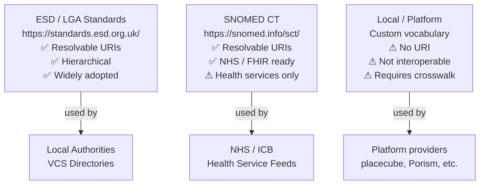
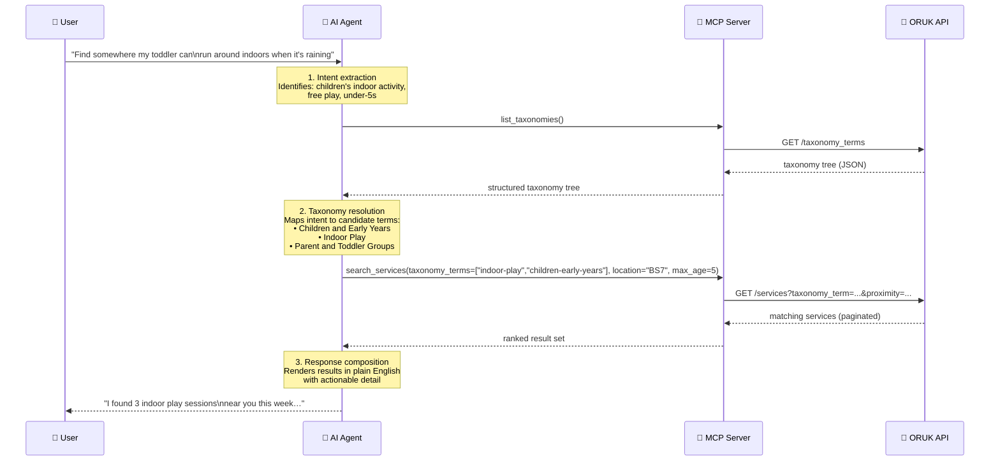
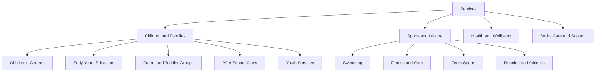
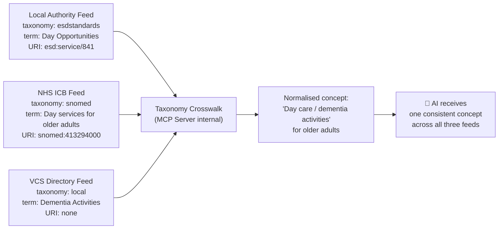
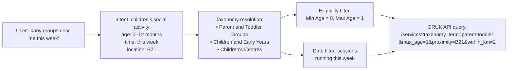
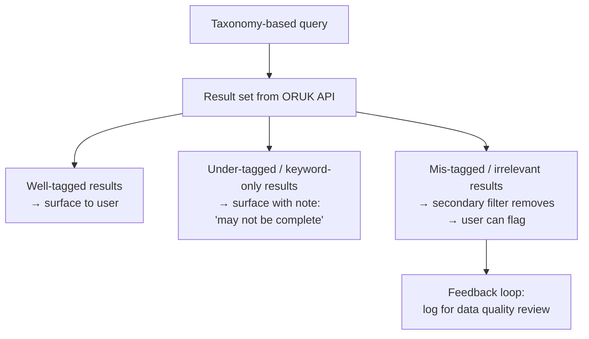

# Taxonomies and the AI Mediation Layer

## Why Taxonomies Matter

Open Referral UK service data is structured, not just stored.  Every service in an ORUK feed can carry one or more **taxonomy terms** — standardised labels that classify *what kind of service* it is, *who it is for*, and *what need it addresses*.

Without taxonomy terms, querying an ORUK API is limited to keyword matching against free-text fields such as service names and descriptions.  This is fragile:

- A service called *"Bounce and Rhyme"* may never mention the words *"baby group"*, *"children"* or *"under-twos"*.
- A service called *"Forget Me Not"* may be a dementia café with no indication of that in its name.
- Keyword search returns false positives (a "school of fish" art class matching a search for "school").

Taxonomy terms solve this by providing a **machine-readable classification that is independent of the service's marketing name**.

---

## The ORUK Taxonomy Model

In ORUK v3 (built on HSDS 3.x), taxonomy classification is attached to services through an `attributes` array.  Each attribute entry carries a nested `taxonomy_term` object identifying the classification scheme, the term, and — where available — a resolvable URI for the concept:

```json
{
  "attributes": [
    {
      "link_type": "taxonomy",
      "taxonomy_term": {
        "id": "3f7b145d-84af-42d7-8fae-eaca714b02b2",
        "name": "Day Opportunities",
        "taxonomy": "esdstandards",
        "term_uri": "https://standards.esd.org.uk/?uri=esd%3Aservice%2F841",
        "parent_id": "0bc248fa-dc27-4650-9ba4-8f1a24ef16a2"
      }
    }
  ]
}
```

The taxonomy terms themselves are retrievable from two API endpoints:

| Endpoint | Returns |
|----------|---------|
| `GET /taxonomies` | The classification schemes in use on this feed |
| `GET /taxonomy_terms` | All terms, with parent–child relationships |

This means an MCP server can **load the full taxonomy tree** from an endpoint at startup and use it to support translation of user language into precise query terms.

---

## Taxonomy Schemes in Use Across UK Feeds

Not all ORUK feeds use the same classification scheme.  Three main types are encountered in practice:

### Type 1 – ESD / LGA Service List ✅

The [Electronic Service Delivery (ESD) Standards vocabulary](https://standards.esd.org.uk/) published by the Local Government Association is the most widely used scheme in UK local authority feeds.  Terms carry resolvable URIs and are hierarchically organised.

> Example: `Day Opportunities` → parent: `Social Care and Support` → parent: `Care and Support for Adults`

### Type 2 – SNOMED CT ✅

NHS-aligned feeds covering health services may carry [SNOMED CT](https://digital.nhs.uk/services/terminology-and-classifications/snomed-ct) codes.  SNOMED URIs are directly usable in both Schema.org and FHIR outputs.

> Example: `Mental health counselling service` → `http://snomed.info/sct/394914008`

### Type 3 – Local / Platform Vocabulary ⚠️

Many real-world feeds — including those from major platform providers — carry custom, non-standardised taxonomy terms.  These may be consistent within a single platform but are not interoperable across feeds without a crosswalk.

> Example: `"taxonomy": "local"`, `"name": "Children & Families"` — no `term_uri`



---

## The Translation Problem

The gap between **how users speak** and **how ORUK data is classified** is the central challenge the MCP server and AI agent must solve together.

### User Language vs Taxonomy Language

| What the user says | Likely taxonomy term(s) | Taxonomy scheme |
|---|---|---|
| "baby group" | `Children and Early Years`, `Children's Centres`, `Parent and Toddler Groups` | ESD / local |
| "swimming lessons for kids" | `Sports and Leisure`, `Swimming`, `Children's Activities` | ESD / local |
| "somewhere for Dad with dementia" | `Dementia Services`, `Day Opportunities`, `Memory Services` | ESD / SNOMED |
| "help with my shopping" | `Domestic Support`, `Home Help`, `Voluntary Transport` | ESD / local |
| "football club for my 11-year-old" | `Sports Clubs`, `Junior Sport`, `Youth Services` | ESD / local |
| "carer's support group" | `Carers Services`, `Support Groups`, `Carer Wellbeing` | ESD / local |
| "free gym" | `Sports and Leisure`, `Fitness`, `Leisure Centres` | ESD / local |
| "food bank" | `Food Banks`, `Emergency Food`, `Crisis Support` | ESD / local |

A traditional keyword search over these terms is fragile.  A taxonomy-aware search is precise.

---

## How the AI Agent Mediates

The AI assistant (Copilot, ChatGPT, Claude) acts as a **semantic bridge** between the user's natural language and the ORUK taxonomy.  This happens in a three-stage pipeline:



### Stage 1 — Intent Extraction

The AI analyses the user's utterance and extracts structured intent:
- **Activity type** (play, sport, support, care, learning)
- **Age group** (baby, toddler, child, adult, older person)
- **Target person** (self, child, spouse, parent)
- **Constraints** (free, accessible, near me, today)
- **Implicit context** from the conversation so far

### Stage 2 — Taxonomy Resolution

The AI maps the extracted intent to one or more candidate taxonomy terms.  This involves:

1. **Direct matching** — the user says "swimming club" and the taxonomy contains `Swimming Clubs`.
2. **Synonym expansion** — the user says "fitness class" and the AI considers `Gym`, `Exercise Classes`, `Sports and Leisure`, `HIIT`, `Yoga`.
3. **Hierarchical expansion** — if no results are found for a narrow term (e.g. `Sensory Play`), the AI widens to the parent term (`Children's Activities`) and filters in post-processing.
4. **Disambiguation** — the user says "school" and the AI must determine from context whether they mean a primary school, a driving school, a school of dance, or a school holiday activity.
5. **Local vocabulary fallback** — if the endpoint uses a local taxonomy with no ESD URIs, the AI queries `GET /taxonomy_terms`, scans the term names, and selects the closest match by label.

### Stage 3 — Response Composition

The MCP server returns structured ORUK service objects.  The AI then:
- Formats them into readable prose with key facts surfaced (name, distance, cost, times)
- Applies any further constraints the user specified (free only, accessible, open today)
- Flags any data gaps honestly rather than presenting incomplete data as complete
- Offers to refine, expand, or get more detail

---

## Taxonomy Hierarchy and Drill-Down

ESD and SNOMED terms form **hierarchical trees**.  The MCP server can exploit this structure in two ways:

**Broad-to-narrow** — start at a high-level category and let the user refine:



**Narrow-to-broad fallback** — if a precise term returns no results, the AI automatically expands to the parent:

> Search for `Sensory Play` → 0 results
> → Expand to `Parent and Toddler Groups` → 3 results
> → AI tells user: *"I didn't find anything specifically labelled sensory play, but here are toddler groups nearby that may include sensory activities — it's worth calling ahead."*

---

## Multi-Taxonomy Environments

When an MCP server aggregates multiple ORUK feeds, it is likely that those feeds use **different taxonomy schemes**.  The same service type may appear as `Day Care` in one feed and `Day Opportunities` in another.

The MCP server needs a **taxonomy crosswalk layer** to normalise these before presenting a unified result set to the AI:



Crosswalk strategies, in order of preference:

| Strategy | When to use |
|----------|-------------|
| Match on `term_uri` (ESD ↔ ESD, SNOMED ↔ SNOMED) | Both feeds carry resolvable URIs for the same scheme |
| Match on `term_uri` across schemes via published crosswalk | ESD ↔ SNOMED crosswalk published by NHS/LGA |
| Match on normalised label (case-insensitive, stemmed) | One or both feeds use local vocabulary |
| Embed taxonomy terms and match by semantic similarity | Local vocabularies with no shared labels; AI-assisted |

---

## Eligibility Taxonomies

Beyond service category, ORUK feeds carry taxonomy terms that describe **who a service is for** — eligibility conditions expressed as structured vocabulary.  These are equally important for precise querying.

| Eligibility dimension | Example taxonomy terms |
|-----------------------|------------------------|
| **Age group** | `0–5 years`, `Children (5–16)`, `Older Adults (65+)` |
| **Life circumstance** | `Carer`, `Lone Parent`, `Recently Bereaved`, `Care Leaver` |
| **Health condition** | `Dementia`, `Physical Disability`, `Mental Health`, `Learning Disability` |
| **Residency** | `Bristol Residents Only`, `CCG Registered Patients` |
| **Referral required** | `Self-referral`, `GP Referral`, `Social Worker Referral` |
| **Cost / means test** | `Free`, `Means-tested`, `Funded by Local Authority` |

The AI uses these eligibility taxonomies to drive the `check_eligibility` MCP tool call, filtering results to only those services a specific user is likely to be able to access.

---

## Persona Examples — Taxonomy in Action

### Priya (young mum) — how taxonomy enables her query

> *"Are there any baby groups near me this week?"*



Without the taxonomy term `Parent and Toddler Groups`, the query would miss the *Bounce and Rhyme* session (whose name says nothing about babies) and the *Stay and Play* session (which has no "baby" keyword in its description).

---

### Margaret (carer) — disambiguation via taxonomy

> *"Find somewhere for my husband with Alzheimer's during the day"*

The word "somewhere" could match almost any service.  Taxonomy resolution disambiguates:

| Candidate term | Rejected because… |
|---|---|
| `Day Nurseries` | Max age = 5; husband is 76 |
| `Day Centres` | ✅ Accepted |
| `Day Opportunities` | ✅ Accepted |
| `Memory Services` | ✅ Accepted — SNOMED: dementia |
| `Residential Care` | Rejected — overnight provision, not day service |

The AI selects `Day Centres`, `Day Opportunities`, and `Memory Services` as query terms, passes `min_age=65` and an eligibility tag of `dementia`, and receives only relevant results.

---

### Kieran (fitness) — synonym expansion across local vocabulary feeds

> *"Find fitness classes near Ancoats"*

Manchester's ORUK feed uses a local taxonomy.  The AI calls `GET /taxonomy_terms`, scans the 240 local terms, and identifies the following candidates by label matching:

- `Fitness and Gym` ✅
- `Exercise Classes` ✅
- `Leisure Centres` ✅ (parent — include for breadth)
- `Weight Training` ✅
- `HIIT` — not present in this feed's taxonomy

It then includes `HIIT` as a free-text keyword filter alongside the taxonomy terms, capturing any service whose *description* mentions HIIT even without a taxonomy tag.

---

## Data Quality and the Taxonomy Gap

Taxonomy-based querying only works as well as the quality of taxonomy tagging in the underlying feeds.  Two failure modes are common:

### Under-tagging
A service exists in the feed but has no taxonomy terms.  It can only be found via keyword search.  The AI should:
1. Always run a parallel keyword search alongside taxonomy queries.
2. Flag to the user when results may be incomplete due to data quality.

### Mis-tagging
A service has taxonomy terms that are too broad or incorrect.  The AI may surface irrelevant results.

> A climbing wall tagged as `Children's Activities` and `Sports and Leisure` appears in a search for `baby groups`.

The AI should apply secondary filters (eligibility age range, description analysis) to reduce noise, and allow the user to dismiss irrelevant results conversationally.



---

## Summary

Taxonomies are not a detail of the ORUK data model — they are the **primary mechanism** by which an AI agent can turn a vague natural language question into a precise, targeted API query.

The division of responsibility is:

| Responsibility | Who handles it |
|---|---|
| Speaking in natural language | The user |
| Extracting intent from language | The AI agent |
| Mapping intent to taxonomy terms | The AI agent (using taxonomy tree from MCP) |
| Forming and executing the API query | The MCP server |
| Aggregating and normalising across feeds | The MCP server (crosswalk layer) |
| Presenting results in plain English | The AI agent |
| Flagging data quality gaps | Both — MCP server annotates, AI surfaces |

The AI agent does not need to understand ORUK schema internals.  It needs to understand **what the user wants** and have access — via the MCP `list_taxonomies` tool — to the vocabulary that the endpoints use to classify what they have.  Everything else is mediation.
