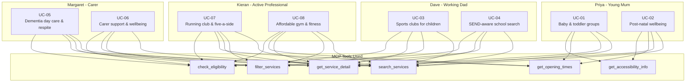

# Use Cases

Each use case is grounded in one of the [personas](personas.md) and describes how an MCP-enabled AI assistant could support a real interaction with Open Referral UK service data.  Representative AI conversations are shown to illustrate the natural language experience.

---

## UC-01 – Baby and Toddler Group Discovery

**Persona:** Priya Sharma (young first-time mum, Birmingham)
**AI Platform:** ChatGPT on mobile

### Scenario

It is a Wednesday morning.  Amara has been crying since 5am and Priya is exhausted and lonely.  She opens ChatGPT and types while feeding Amara.

### Conversation

> **Priya:** I need to get out of the house with my 4-month-old.  Are there any baby groups near me in Handsworth today?
>
> **AI:** I can help with that.  I found 3 baby and toddler groups in the B21 area with sessions today:
>
> **1. Handsworth Family Hub – Baby Bounce & Rhyme**
> 📍 Holly Road, Handsworth · 0.4 miles
> ⏰ Today 10:00–11:30am · Free · Drop-in, no booking needed
> Run by Birmingham City Council · suitable from birth
>
> **2. St Andrew's Church Parent & Baby Group**
> 📍 Church Hill Road, Handsworth · 0.8 miles
> ⏰ Today 9:30–11:00am · £1.50 suggested donation
> Refreshments provided · 0–18 months
>
> **3. Soho Road Children's Centre – Stay & Play**
> 📍 Soho Road · 1.1 miles
> ⏰ Today 1:00–3:00pm · Free · First visit drop-in, register on site
>
> Would you like directions, more details, or information about regular weekly sessions you could build into a routine?
>
> **Priya:** Is the Family Hub one accessible by pram?  And do they have anything in Punjabi?
>
> **AI:** Yes — the Family Hub on Holly Road has step-free access throughout and a designated pram park.  I don't have a record of Punjabi-language sessions there specifically, but Birmingham City Council's Family Hubs service does offer interpreter support on request.  I can give you the contact number so you can check before you go.

### Capabilities Demonstrated

- `search_services` with location, date filter, and taxonomy (`baby groups`, `children's centres`)
- `get_opening_times` to surface today's sessions
- `get_accessibility_info` for pram / step-free access
- Multi-turn context retention (follow-up about the first result)
- Honest acknowledgement of data gaps (Punjabi sessions not recorded in feed)

---

## UC-02 – Post-Natal Wellbeing Support

**Persona:** Priya Sharma
**AI Platform:** ChatGPT on mobile (continuing the same conversation thread)

### Scenario

Later that day, Priya mentions to ChatGPT that she has been feeling "a bit down" since Amara was born and wonders if there is anything that might help.

### Conversation

> **Priya:** I've been feeling a bit down since she was born — like not myself.  Is there anything locally that could help?
>
> **AI:** What you're describing sounds like it could be postnatal low mood, which is really common and very treatable — you're not alone.  There are a few types of support available locally:
>
> **NHS Health Visitor** – Your named health visitor can do a wellbeing check and refer you to specialist support if needed.  If you're not sure who yours is, your GP surgery can tell you.
>
> **Perinatal Mental Health Drop-In (Birmingham Women's NHS FT)**
> 📍 Ladywood Health Centre · Tuesdays 2–4pm · Free · No referral needed
>
> **PANDAS Foundation Peer Support Group – Birmingham**
> 📍 Online (Zoom) and in-person at Handsworth Library on alternate Thursdays · Free
>
> **Home-Start Birmingham Volunteer Befriending**
> A trained volunteer visits you at home for a few hours each week for a few months.  Referral via GP or self-referral accepted.
>
> Would you like me to find the self-referral details for any of these?  And if at any point things feel overwhelming, please do reach out to your GP or call NHS 111.

### Capabilities Demonstrated

- Proactive service discovery triggered by a conversational cue, not a direct query
- `search_services` across health and voluntary sector ORUK feeds simultaneously
- Appropriate signposting to NHS services alongside VCS directory results
- Safety-conscious response with NHS 111 mention
- `get_service_detail` to surface contact / referral routes on follow-up

---

## UC-03 – After-School Sports Club for a Child

**Persona:** Dave Morley (working dad, Leeds)
**AI Platform:** Microsoft Copilot 365 (on phone, Teams mobile)

### Scenario

Dave is between jobs on a Thursday lunchtime and has 10 minutes.  Sharon has asked him to find a football club for Jayden (11).

### Conversation

> **Dave:** Find me a football club for my lad, he's 11, in south Leeds, preferably after school on weekdays.
>
> **Copilot:** Here are football clubs running weekday sessions for under-12s in south Leeds:
>
> **1. Beeston St Anthony's JFC – Under-12s Training**
> 📍 Elland Road Community Pitches · 1.2 miles from LS11
> ⏰ Tuesdays and Thursdays 5:30–7:00pm · £3/session or £20/month
> FA-registered; coaching by qualified Level 2 coaches
>
> **2. Leeds United Foundation – After School Kicks**
> 📍 John Charles Centre for Sport · 2.8 miles
> ⏰ Mondays and Wednesdays 4:30–5:30pm · **Free** (funded by PL Kicks)
> For ages 8–14; no sign-up required for first session
>
> **3. Morley Town FC – Under-12s Squad**
> 📍 Morley Victoria Ground · 3.5 miles
> ⏰ Thursdays 5:00–6:30pm · Registration required; £15 joining fee
>
> The Leeds United Foundation one is free and close to two bus routes from Beeston — want me to pull up the bus times or more detail on registration for any of these?
>
> **Dave:** What about swimming for his sister — she's 8?
>
> **Copilot:** For 8-year-olds in south Leeds, here are swimming options:
>
> **South Leeds Leisure Centre – Junior Swimming Lessons**
> 📍 Middleton Grove, LS10 · 2.1 miles
> Saturdays 9:00–9:30am (Stage 4–6) · £6.50/lesson or included in Family Leisure Pass
> Waiting list currently 4–6 weeks; self-referral online
>
> **Leeds Swimming Academy – Beeston Pool Lessons**
> 📍 Beeston Leisure Centre · 0.9 miles
> Thursdays 5:15pm (Stage 3–5) and Saturdays 10:00am · Pay-as-you-go available
>
> Your council **Family Leisure Pass** (income-assessed, free or discounted) would cover both of these.  Want details on how to apply?

### Capabilities Demonstrated

- `search_services` with age, activity type, location, day-of-week filters
- `filter_services` for free-only flag on follow-up
- Cross-persona implicit context (first child then sibling)
- `get_service_detail` for pricing, eligibility, registration details
- Proactive mention of relevant council entitlement scheme (Family Leisure Pass)

---

## UC-04 – Choosing a School for a Child with Additional Needs

**Persona:** Dave Morley (extended scenario)
**AI Platform:** Microsoft Copilot 365

### Scenario

Dave and Sharon are considering moving Chloe (8) to a different primary school because she has recently been assessed with dyspraxia and they feel her current school isn't well equipped.

### Conversation

> **Sharon (via Dave's phone):** We need to find a primary school in south Leeds that's good with kids who have dyspraxia and motor difficulties.  Chloe's 8.
>
> **Copilot:** I can help you explore this.  In the Leeds ORUK service directory, three schools in south Leeds have recorded specialist SEND provision relevant to dyspraxia and developmental coordination disorder:
>
> **Middleton Primary School**
> SEND provisions: OT input on-site (weekly), sensory movement breaks, dyslexia/dyspraxia-trained TAs
> Ofsted: Good (2023) · Currently has Year 3/4 spaces
>
> **Beeston Hill St Luke's CE Primary**
> SEND provisions: SENCO with SpLD specialism, movement programme (Write Dance), small-group motor skills sessions
> Ofsted: Good (2022)
>
> **West Hunslet Community Primary**
> SEND provisions: Nurture group, OT referral pathway, sensory room
> Ofsted: Requires Improvement (2024) – improvement plan in place
>
> Each school should be contacted directly to discuss Chloe's specific needs; SEND provision can change term-to-term.  Leeds City Council's SEND Information Advice and Support Service (SENDIASS) can also provide independent advice — would you like their contact details?

### Capabilities Demonstrated

- `search_services` with taxonomy: `primary education`, `SEND provision`, `dyspraxia`
- `filter_services` by geography and age group
- `get_service_detail` for SEND-specific attributes published in ORUK feed
- Honest data caveats (provision changes)
- Proactive signposting to SENDIASS — a statutory service

---

## UC-05 – Day Care and Respite for a Dementia Patient

**Persona:** Margaret Hughes (carer for husband with Alzheimer's, Bristol)
**AI Platform:** Claude (desktop, using MCP)

### Scenario

It is a Sunday evening.  Gerald is asleep and Margaret has half an hour.  Her GP mentioned "day services" at her last appointment and she wants to understand what is available.

### Conversation

> **Margaret:** My husband has Alzheimer's and I need to find somewhere he could go during the day, even just once or twice a week, so I can rest.  We're in Bristol, Bishopston area.
>
> **Claude:** That sounds like a really important step to take — having planned breaks makes a real difference to carers over the long term.  Here is what I found in the Bristol services directory:
>
> **1. Alive! – Creative Activities for Dementia (Bishopston Library)**
> 📍 Bishopston Library, Gloucester Road · 0.6 miles
> ⏰ Wednesdays 10:00am–12:00pm · Free
> Music, art and reminiscence activities; no referral needed; carer can stay or use the time freely
>
> **2. Brunelcare – Ashley Day Service**
> 📍 Ashley, Bristol BS6 · 1.8 miles
> ⏰ Monday, Wednesday, Friday – full day 9am–4pm
> Funded or self-funded; social care assessment required for funded place
> Includes lunch, personal care, transport can be arranged
>
> **3. Alzheimer's Society – Singing for the Brain (Cotham)**
> 📍 Cotham Parish Church · 1.4 miles
> ⏰ Fortnightly Thursdays 2:00–3:30pm · Free · Drop-in
>
> **4. Bristol Dementia Wellbeing Service (NHS)**
> Covers all of Bristol; referral via GP or memory clinic
> Provides a named keyworker, day activities coordination, and carer support planning
>
> The **Brunelcare day service** sounds closest to what you're describing.  To get a funded place, Bristol City Council Adult Social Care would need to do a Carer's Assessment for you and a needs assessment for Gerald — your GP or the Dementia Wellbeing Service can help initiate that.  Would you like their contact details?
>
> **Margaret:** What about transport?  Gerald can't manage a bus.
>
> **Claude:** The Brunelcare Ashley Day Service has its own transport — they can collect and return Gerald on days he attends; this is included in the funded package or can be arranged privately.
>
> There is also **Ring and Ride West of England** — a door-to-door accessible minibus service for people who can't use standard public transport.  It covers BS7 and can be booked in advance.  Registration is free; there's a small per-journey fare.  Would you like the referral details?

### Capabilities Demonstrated

- `search_services` with taxonomy: `dementia`, `day services`, `carer respite`
- `filter_services` by proximity and day-of-week
- `get_service_detail` for transport provisions, referral pathway, funding eligibility
- `check_eligibility` to distinguish funded (assessment-required) vs. self-funded vs. free drop-in
- Emotional tone calibrated to a fatigued, caring user
- Multi-turn follow-up on transport without repeating context

---

## UC-06 – Carer Support Group and Wellbeing

**Persona:** Margaret Hughes
**AI Platform:** Claude (continuing conversation)

### Scenario

Encouraged by the previous results, Margaret asks about support for herself.

### Conversation

> **Margaret:** Is there anything for me as well — somewhere to meet other carers?
>
> **Claude:** Absolutely — carer wellbeing is just as important as the support for Gerald.  Here are some options specifically for carers in Bristol:
>
> **Carers Support Centre Bristol**
> 📍 The Vassall Centre, Fishponds Road · 3.2 miles (also home visits and online)
> Free advice, emotional support, and a monthly carer café
> GP or self-referral; you can register online or by phone
>
> **Alzheimer's Society Carer Support Group – Bristol North**
> 📍 Westbury-on-Trym Village Hall · 3.8 miles
> ⏰ Second Tuesday of each month, 2:00–4:00pm · Free
> Peer support for carers of people with any dementia type
>
> **Bristol Wellbeing College – Free Courses for Carers**
> Includes: Mindfulness for Carers (6 weeks), Managing Stress, Better Sleep
> All online or in-person; free and open access; no referral needed
>
> You are also entitled to a **Carer's Assessment** from Bristol City Council — this is free and can unlock additional support, including short breaks and emergency cover.  Your GP, the Carers Support Centre or I can help you with how to request one.

### Capabilities Demonstrated

- Implicit context from previous turn (Margaret is a carer, Gerald has Alzheimer's)
- `search_services` with taxonomy: `carer support`, `peer support groups`, `mental wellbeing`
- Awareness of statutory entitlements (Carer's Assessment) published in service feeds
- Breadth of results across health, VCS, and education (Wellbeing College)

---

## UC-07 – Finding a Running Club

**Persona:** Kieran O'Brien (young professional, Manchester)
**AI Platform:** Claude (desktop)

### Scenario

Monday evening.  Kieran has been for a lone run and wants to join a club.

### Conversation

> **Kieran:** I want to join a running club in Manchester — I'm in Ancoats, M4.  I'm doing about 25 miles a week so not a beginner.  Looking for something with weekend long runs.
>
> **Claude:** Here are running clubs close to Ancoats that have weekend long runs and cater to intermediate/experienced runners:
>
> **1. Manchester YMCA Harriers**
> 📍 Based in city centre; meets at Piccadilly Gardens (0.6 miles)
> ⏰ Saturday 8:30am long run (8–16 miles); Tuesday track session
> England Athletics affiliated; beginner-friendly up to sub-3:30 marathon groups
> Free first run; membership £25/year
>
> **2. Run Manchester (Parkway Running)**
> 📍 Northern Quarter meetup · 0.7 miles
> ⏰ Sunday 8:00am easy long run (9–14 miles); Thursday intervals
> Informal club; Strava group; pay-what-you-can
>
> **3. Sale Harriers Manchester**
> 📍 Sale (5.4 miles; accessible by Metrolink)
> One of the larger clubs in the region; competitive and recreational streams; strong marathon training programme
> ⏰ Multiple weekly sessions; Saturday club run 9:00am
>
> Given your weekly mileage, any of these would suit you.  The YMCA Harriers are the closest geographically.  Would you like contact details or directions for any of them?
>
> **Kieran:** Any five-a-side football as well?
>
> **Claude:** Yes — here are five-a-side options in and around Ancoats:
>
> **Goals Manchester – Sportcity (weekly leagues)**
> 📍 Alan Turing Way, Manchester · 1.4 miles
> Weekday evening leagues and casual Sunday sessions; teams or solo sign-up to be matched
>
> **Manchester City Council – Beswick Sports Village**
> 📍 Grey Mare Lane · 1.6 miles
> Pay-as-you-go 5-a-side bookings from £12/pitch/hour; pitch booking app available
>
> **Ancoats FC Community Sessions**
> 📍 Poland Street Astro · 0.4 miles
> ⏰ Thursdays 7:00–8:30pm · £5 cash · Drop-in, no commitment
> Community-run; mixed ability; about 15–20 turn up each week
>
> The Ancoats FC one sounds like a good low-commitment way to meet people locally.

### Capabilities Demonstrated

- `search_services` with taxonomy: `running clubs`, `athletics`, `community sport`
- `filter_services` by ability level and session type (long run)
- `search_services` pivot to second activity type within same conversation
- `get_opening_times` to show session schedules
- Pricing detail from ORUK feed (`get_service_detail`)

---

## UC-08 – Fitness on a Budget

**Persona:** Kieran O'Brien (extended)
**AI Platform:** Claude

### Scenario

Kieran is paying central Manchester rents and wants to know about lower-cost gym and class options.

### Conversation

> **Kieran:** What gyms or fitness classes are there in or near Ancoats that aren't too expensive?  I'm mainly into strength training and HIIT.
>
> **Claude:** Here are affordable options near Ancoats for strength and HIIT training:
>
> **Manchester City Council – Beswick Sports Village**
> 📍 1.6 miles · Pay-as-you-go £5.20/visit or Active Manchester membership from £23.50/month
> Full weights room, fitness classes included; council-run, no long contract
>
> **Better (GLL) – Ancoats Leisure Centre** *(scheduled to reopen Q3 2025)*
> 📍 0.4 miles · Watch this space — not yet available to book but contact details on record
>
> **PureGym Manchester City**
> 📍 0.9 miles · From £17.99/month; 24-hour access; free weights, rack, HIIT studio
>
> **CrossFit NQ (Northern Quarter)**
> 📍 0.8 miles · Drop-in £15; monthly membership from £75
> Community box; Olympic lifting, functional fitness; trial session free
>
> For the most budget-friendly option with classes included, the council's Active Manchester membership is usually best value.  If you're eligible (full-time employment in Manchester), you may qualify for a **Healthy Living Discount** — want me to check the eligibility criteria?

### Capabilities Demonstrated

- `search_services` with taxonomy: `fitness`, `gyms`, `HIIT`, `strength training`
- `filter_services` with cost parameters; ordering by price
- Honest data caveat (Ancoats Leisure Centre reopening status)
- `check_eligibility` for concessionary membership offer

---

## Use Case Summary

### Key Observations Across All Use Cases

1. **No use case is a single search.**  Every scenario involves at least two tool calls — an initial discovery call followed by a detail, eligibility, or opening-times refinement.  Conversational AI handles this naturally; traditional search cannot.

2. **Data quality gates capability.**  All eight use cases depend on the ORUK feeds being reasonably complete and up to date.  Where data is absent, the AI must acknowledge this honestly rather than hallucinate.

3. **Multi-feed aggregation unlocks breadth.**  The most useful responses (e.g. UC-03 spanning leisure trust, voluntary sector, and council-funded activities) only arise when the MCP server aggregates multiple ORUK feeds simultaneously.

4. **Tone matters as much as data.**  UC-05 and UC-06 involve an emotionally fatigued user.  The AI's tone — empathetic, not transactional — is as important as the accuracy of the results.  This is shaped by the AI assistant's own capabilities, not the MCP server, but the use cases demonstrate where emotional intelligence matters.

5. **Signposting to statutory services is essential.**  In UC-02, UC-04, UC-05, and UC-06, the most important outcome is not a VCS service listing but a pointer to a statutory assessment or NHS pathway.  ORUK feeds that include statutory services (NHS, local authority) are more valuable than those that do not.
