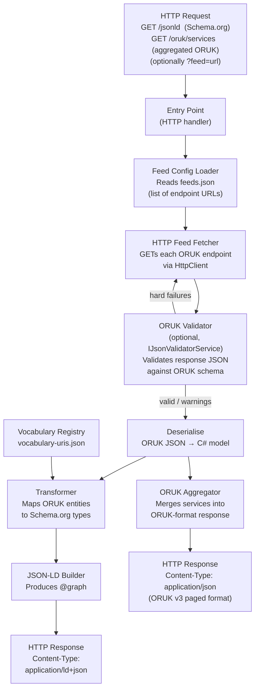
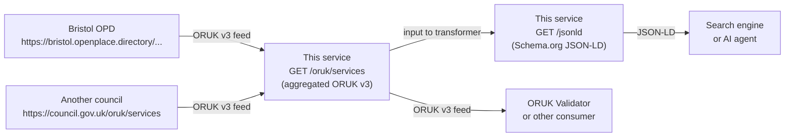

# Technical Approach – ORUK to Schema.org Transformation Service

## Goal

Build a lightweight service that reads a JSON configuration file listing one or more **Open Referral UK (ORUK)** feed endpoint URLs, fetches the live data from each endpoint over HTTP, and produces a single, consolidated **Schema.org JSON-LD** response.

The service requires no UI.  It must be deployable as:

- A **Heroku** web dyno (alongside the iStandUK ORUK Validator), or
- An **Azure Function** (HTTP trigger), or
- An equivalent **GCP Cloud Function** or **AWS Lambda**.

The implementation language is **C#** targeting **.NET 10 (LTS)**, running on Linux in Docker or on Windows.

---

## Architecture Overview



For future FHIR output, the transformer also consults an optional terminology server to translate taxonomy codes to SNOMED CT `CodeableConcept` values.  See [terminology.md](terminology.md) for the full architecture including the FHIR path.

---

## Project Structure (proposed)

```
/
├── src/
│   └── OrukTransformer/
│       ├── OrukTransformer.csproj
│       ├── Program.cs                       # Minimal API host
│       ├── Models/
│       │   ├── Oruk/                        # C# records matching ORUK v3 schema
│       │   └── SchemaOrg/                   # C# records for Schema.org JSON-LD output
│       ├── Services/
│       │   ├── IFeedConfigLoader.cs
│       │   ├── FileFeedConfigLoader.cs      # Reads feeds.json (list of URLs)
│       │   ├── IFeedFetcher.cs
│       │   ├── HttpFeedFetcher.cs           # Fetches ORUK data via HttpClient
│       │   ├── IOrukValidator.cs
│       │   ├── OrukSchemaValidator.cs       # Validates response against ORUK JSON Schema
│       │   ├── IVocabularyRegistry.cs
│       │   ├── VocabularyRegistry.cs        # Loads vocabulary-uris.json; normalises lookups
│       │   ├── ITerminologyClient.cs        # (future) FHIR TS $translate / $lookup
│       │   ├── ITransformer.cs
│       │   ├── OrukToSchemaOrgTransformer.cs
│       │   ├── IOrukAggregator.cs
│       │   └── OrukFeedAggregator.cs        # Merges feeds into a single ORUK v3 response
│       └── Endpoints/
│           ├── JsonLdEndpoint.cs            # GET /jsonld
│           └── OrukAggregatorEndpoint.cs    # GET /oruk/services (paged, ORUK-conformant)
├── feeds.json                               # List of ORUK endpoint URLs
├── vocabulary-uris.json                     # Vocabulary string → URI template registry
├── tests/
│   └── OrukTransformer.Tests/
│       ├── OrukTransformer.Tests.csproj
│       └── fixtures/                        # Small representative ORUK JSON samples
├── plan/                                    # This directory
├── Dockerfile
├── docker-compose.yml
├── .gitignore
└── README.md
```

---

## Hosting Approaches

### Heroku

- Package as a minimal ASP.NET Core Minimal API application.
- `Program.cs` binds to `$PORT` environment variable (Heroku requirement).
- Deploy via Git push to Heroku remote or a Heroku container registry (Docker).
- `Procfile`: `web: dotnet OrukTransformer.dll`

### Azure Function

- Wrap the transformer in an `HttpTrigger` Azure Function.
- Use the .NET isolated worker model (`net10.0`).
- Deploy via `func azure functionapp publish` or GitHub Actions to Azure.

### GCP Cloud Function / AWS Lambda

- Use the same core transformer library.
- Add a thin adapter entry point per platform (GCP Functions Framework for .NET; AWS Lambda .NET runtime).
- Core business logic stays in a shared class library, platform adapters reference it.

---

## Feed Configuration

- A single `feeds.json` file at the repository root lists the ORUK endpoint URLs to aggregate.  Each entry may be a plain URL string or a typed object:

```json
[
  "https://bristol.openplace.directory/o/OpenReferralService/v3/services",
  "https://another-council.gov.uk/oruk/services",
  {
    "type": "aggregator",
    "url": "https://this-service.example.com/oruk/services"
  }
]
```

- At startup (or per-request) `FileFeedConfigLoader` reads this file and returns the list of feed descriptors.
- `HttpFeedFetcher` issues an HTTP `GET` to each URL in turn using a shared `HttpClient` instance (respecting `IHttpClientFactory` best practices).
- A query parameter `?feed=<url-encoded-url>` allows callers to request a single named feed rather than the full consolidated set.
- If a feed URL is unreachable or returns a non-2xx status, the error is logged and that feed is skipped; remaining feeds continue to be processed.
- Duplicate service IDs across feeds are deduplicated — the first occurrence wins (sources are processed in the order listed in `feeds.json`).

---

## Feed Aggregator Endpoint

In addition to its primary transformation role the service exposes a **combined ORUK API endpoint**:

```
GET /oruk/services?page=1&per_page=50
```

This endpoint:

1. Fetches from all configured feeds (same pipeline as `GET /jsonld`).
2. Merges all `Service` objects into a single de-duplicated collection.
3. Returns the result in the standard ORUK v3 paged response format (`total_items`, `total_pages`, `contents[]`).
4. Sets `Content-Type: application/json` and conforms to the ORUK v3 OpenAPI schema.

This makes the service act as an **ORUK feed aggregator**: the combined endpoint can itself be registered as an ORUK feed URL in the validator or in other service directories, forming a higher-level aggregation layer.



### Aggregator Design Rules

- The aggregator reuses the same deserialization and deduplication logic as the transformer — no separate fetch path.
- Pagination is applied **after** merging and deduplication, using the query parameters `page` (1-based) and `per_page` (default 50, max 100).
- The `api_details` response on `GET /oruk` identifies this service as the aggregator and lists the source feeds.
- The aggregated endpoint intentionally does **not** re-validate outbound responses against the ORUK schema — it trusts that incoming feeds were already validated during ingestion.

---

## Transformation Pipeline

The same fetch-and-deserialise pipeline feeds **two output paths**: Schema.org JSON-LD (`GET /jsonld`) and the combined ORUK aggregator (`GET /oruk/services`).

1. **Fetch** the ORUK data by issuing HTTP `GET` requests to each URL listed in `feeds.json`.
2. **Validate** the raw JSON response against the ORUK JSON Schema (via `IOrukValidator`).  Feeds with hard schema violations are skipped with a logged error; those with warnings continue.
3. **Deserialise** each validated ORUK JSON response into typed C# records (generated from the ORUK OpenAPI schema at `https://openreferraluk.org/specifications/3.0/openapi.json`).
4. **Receive liberally:** missing optional fields do not abort processing; they are omitted from output.  Unreachable or invalid feeds are logged and skipped.
5. **Deduplicate** services by `id` across all feeds — the first occurrence wins.

**Path A – Schema.org JSON-LD (`GET /jsonld`):**

6. **Map** each ORUK `Service` to a `GovernmentService` Schema.org node.  See [mapping.md](mapping.md) for field-level rules.
7. **Map** taxonomy terms: for each `attribute.taxonomy_term`, resolve the `term_uri` (or construct a URI from the `vocabulary-uris.json` registry); emit as `additionalType` where a URI exists, or append to `keywords` where it does not.  See [terminology.md](terminology.md) for full vocabulary handling rules.
8. **Map** each ORUK `Organization` to a `schema:Organization` node.
9. **Map** each ORUK `Location` to a `schema:Place` node with a nested `PostalAddress` and optionally `GeoCoordinates`.
10. **Link** nodes: `GovernmentService.provider` references the `Organization` node by `@id`.
11. **Build** the `@graph` array and serialise to JSON-LD.

**Path B – Combined ORUK feed (`GET /oruk/services`):**

6. **Merge** the de-duplicated `Service` collection from all feeds.
7. **Paginate** using `page` / `per_page` query parameters.
8. **Serialise** as a standard ORUK v3 paged response (`{ total_items, total_pages, contents: [...] }`).
9. **Return** with `Content-Type: application/json`.

---

## Design Principles

| Principle | Application |
|-----------|-------------|
| **Receive liberally** | Accept ORUK feeds even when optional fields are absent or have unexpected types; log warnings rather than rejecting.  Tolerate individual feed URLs that are temporarily unavailable. |
| **Supply conservatively** | Only include fields in the JSON-LD output that have well-defined mappings and non-null values. |
| **Stateless** | The service holds no persistent state; `feeds.json` is the only configuration, and all data is fetched at request time. |
| **Testable** | Business logic (transformer) is injected as a dependency; entry point is thin. |
| **Observable** | Structured logging (Microsoft.Extensions.Logging) with configurable log levels. |

---

## Output Format

```json
{
  "@context": "https://schema.org",
  "@graph": [
    {
      "@type": "GovernmentService",
      "@id": "https://<base-url>/services/<oruk-id>",
      "name": "...",
      "description": "...",
      "provider": { "@id": "https://<base-url>/organisations/<oruk-org-id>" },
      ...
    },
    {
      "@type": "Organization",
      "@id": "https://<base-url>/organisations/<oruk-org-id>",
      "name": "...",
      ...
    }
  ]
}
```

`Content-Type: application/ld+json`

---

## Future Extensions

| Extension | Notes |
|-----------|-------|
| **FHIR output** | `GET /fhir/HealthcareService` returning a FHIR `Bundle`.  Requires terminology server integration to translate ORUK taxonomy terms to SNOMED CT `CodeableConcept` values.  See [terminology.md § 7](terminology.md#7-fhir-terminology-server--role-in-the-architecture). |
| **MCP endpoint** | Model Context Protocol tool for AI agents to query services. |
| **Caching** | Cache transformed output with configurable TTL to avoid re-fetching on every request. |
| **ORUK Validator NuGet** | The `OpenReferralUK/oruk-validator` uses `Newtonsoft.Json.Schema` and will not be refactored to suit this project.  POCOs are generated via `NJsonSchema`.  See [terminology.md § 8](terminology.md#8-oruk-validator--nuget-package-assessment). |
| **Cascading aggregation** | Allow the combined ORUK endpoint (`GET /oruk/services`) to itself be listed as a feed in another instance's `feeds.json`, enabling multi-tier aggregation hierarchies. |

---

## References

- ORUK v3 OpenAPI schema: <https://openreferraluk.org/specifications/3.0/openapi.json>
- OpenReferralUK oruk-validator: <https://github.com/OpenReferralUK/oruk-validator>
- Schema.org GovernmentService: <https://schema.org/GovernmentService>
- ASP.NET Core Minimal API: <https://learn.microsoft.com/en-us/aspnet/core/fundamentals/minimal-apis>
- Azure Functions .NET isolated: <https://learn.microsoft.com/en-us/azure/azure-functions/dotnet-isolated-process-guide>
- Heroku .NET: <https://devcenter.heroku.com/articles/getting-started-with-dotnet>
- Bristol Open Place Directory: <https://bristol.openplace.directory/o/OpenReferralService/v3>
