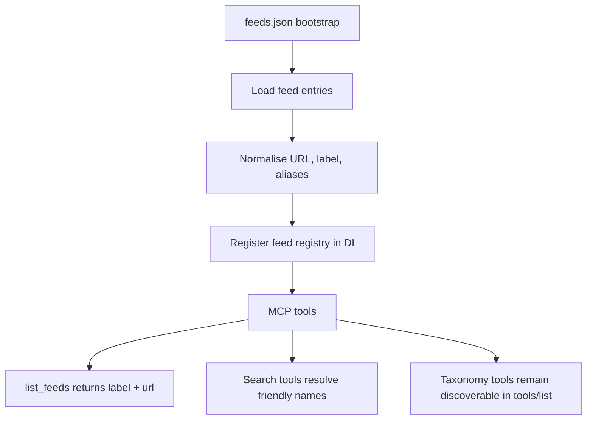

# Epic 67 Plan — MCP Search & Feed Integration

## Problem

Epic #67 covers MCP search/discovery ergonomics: tool discoverability, taxonomy navigation, feed targeting, and schema quality for tool parameters.

The ORUK standard does not define a canonical feed label, so the short-term approach should not try to extend ORUK itself. Instead, the MCP server should read a richer `feeds.json` bootstrap file that includes a human-friendly label and optional aliases alongside each feed URL.

## Learning from #61

- `tools/list` is registered eagerly at startup.
- The current server does not paginate MCP discovery.
- The “missing tools” symptom is likely a client discovery/UI effect rather than a server-side tool-list bug.

That means the epic should focus on documentation, registry shape, and runtime verification rather than building a custom discovery mechanism.

## Proposed approach



### Feed configuration shape

Use `feeds.json` as the source of truth for MCP bootstrap data:

```json
[
  {
    "type": "feed",
    "url": "https://bristol.openplace.directory/o/OpenReferralService/v3",
    "name": "Bristol",
    "aliases": ["bristol"]
  }
]
```

This keeps the ORUK feed URL intact while adding a separate representation for display and lookup.

## Execution plan

1. Update feed-loading code to accept structured feed entries with `name` and `aliases`.
2. Surface `feed_name` in `list_feeds` and any multi-feed result payloads.
3. Allow search tools to resolve friendly feed names from the bootstrap registry while preserving raw URL support.
4. Tighten JSON Schema on constrained parameters where the valid values are known.
5. Keep taxonomy tools registered and documented; use them as a separate discovery aid rather than a dependency for tool listing.
6. Add regression coverage for:
   - tool registration at STDIO startup,
   - feed alias resolution,
   - taxonomy tool discovery.

## Scope notes

- Do not change the ORUK standard to carry feed labels.
- Do not add a custom tools-list pagination or discovery layer.
- Keep raw feed URLs working for backwards compatibility.

## Related issues

- #56 Add friendly `feed_name` label to all service results
- #57 Use JSON Schema enums for constrained parameter values
- #58 Accept friendly feed names as alternative to raw feed URLs
- #61 Confirm `tools/list` returns all tools at STDIO initialisation
- #64 `list_taxonomy_terms` and `resolve_taxonomy_label` availability and correctness

