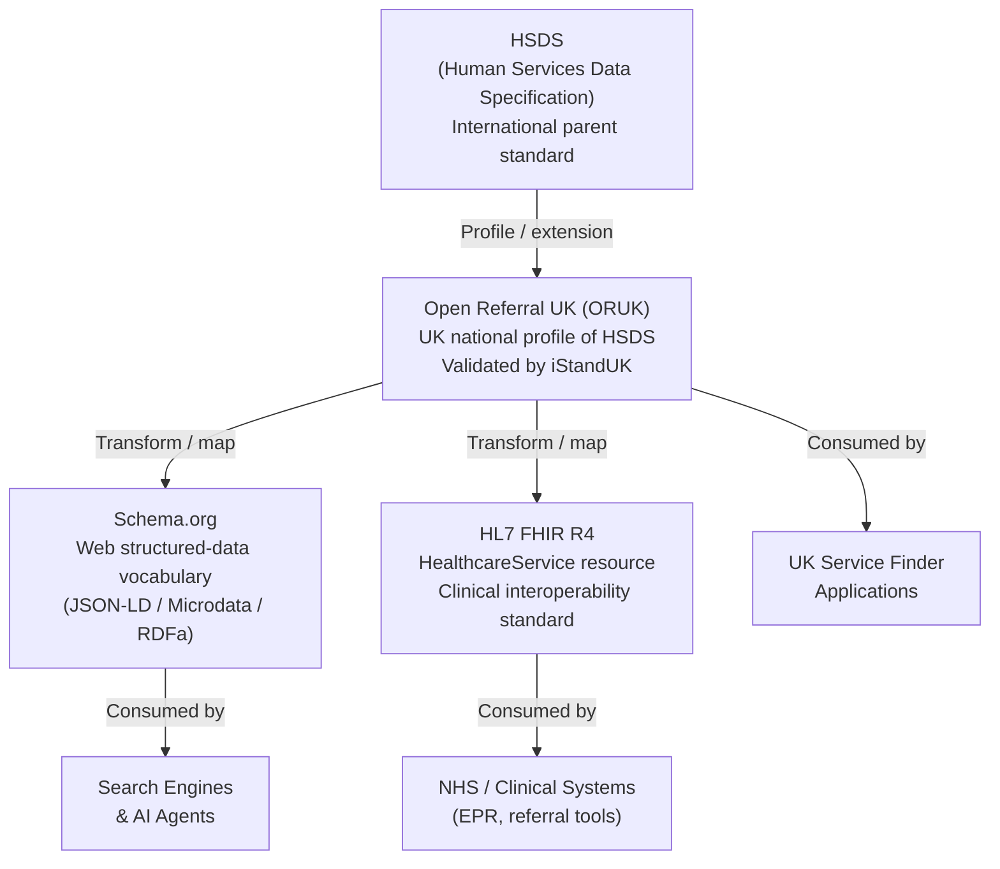
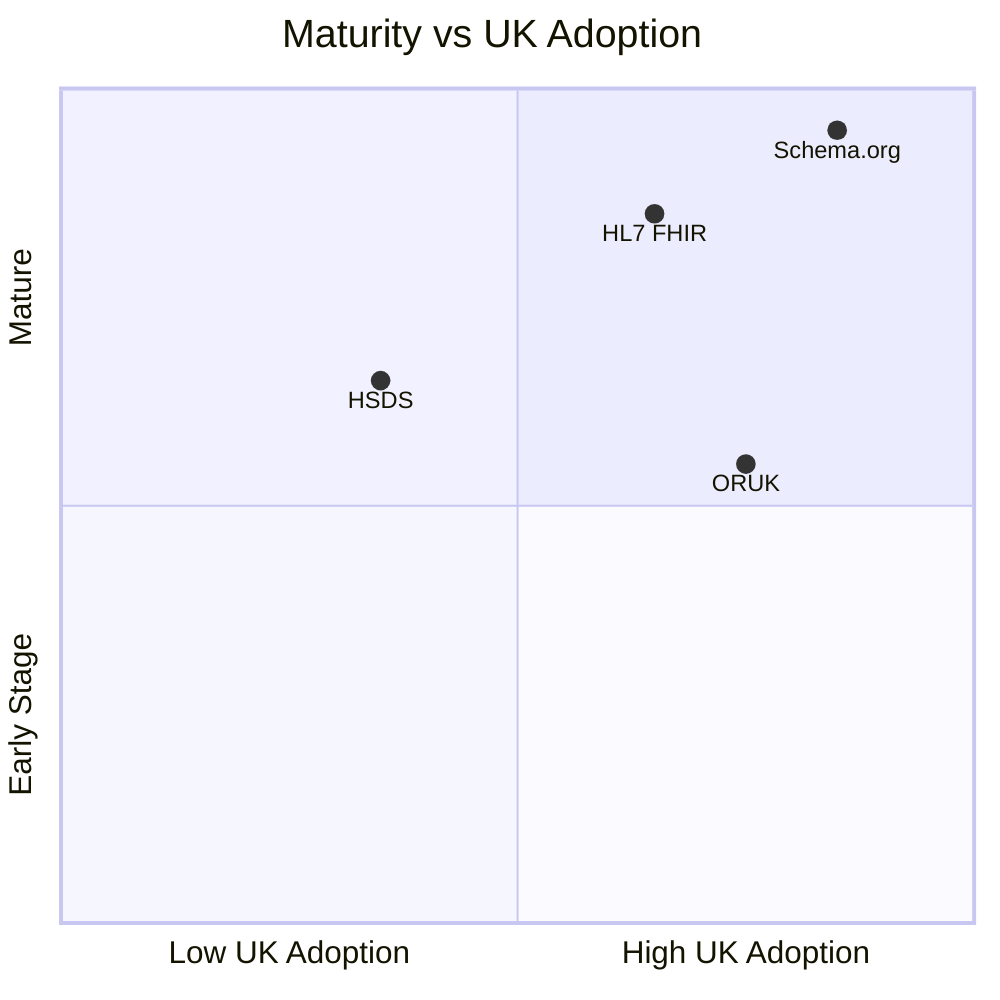

# Standards Reference

This directory contains descriptions of the key standards relevant to the ORUK Alternative Representations project.

## Standards

| Standard | File | Summary |
|----------|------|---------|
| HSDS – Human Services Data Specification | [hsds.md](hsds.md) | The international parent standard for service directories. |
| Open Referral UK (ORUK) | [open-referral-uk.md](open-referral-uk.md) | The UK national profile of HSDS, validated by iStandUK. |
| Schema.org | [schema-org.md](schema-org.md) | Web-structured-data vocabulary used by search engines and AI agents. |
| HL7 FHIR HealthcareService | [hl7-fhir.md](hl7-fhir.md) | Clinical interoperability standard used across NHS England. |

---

## How the Standards Relate

## Use-Case Fit

| Use Case | Best Standard |
|----------|---------------|
| UK local-authority service finder | **ORUK** |
| Search-engine / AI discoverability | **Schema.org** |
| NHS referral / social prescribing integration | **HL7 FHIR** |
| Cross-border / international exchange | **HSDS** |
| Combined web + AI + clinical pipeline | **ORUK → Schema.org + FHIR** |

---

## Standard Maturity and Adoption

---

## Further Reading

- [Plan overview](../README.md)
- [Technical approach](../approach.md)
- [ORUK → Schema.org field mapping](../mapping.md)
