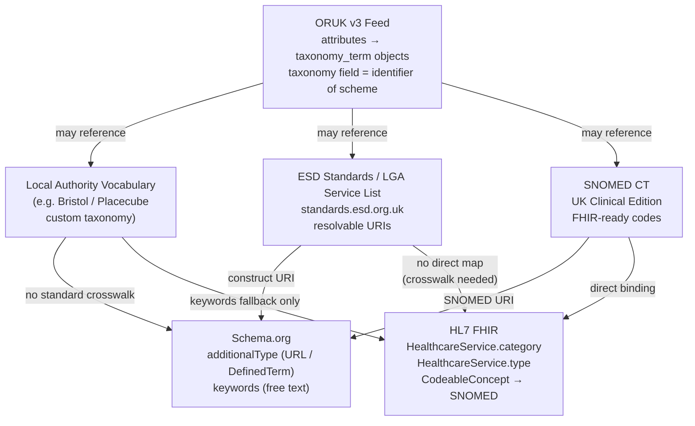
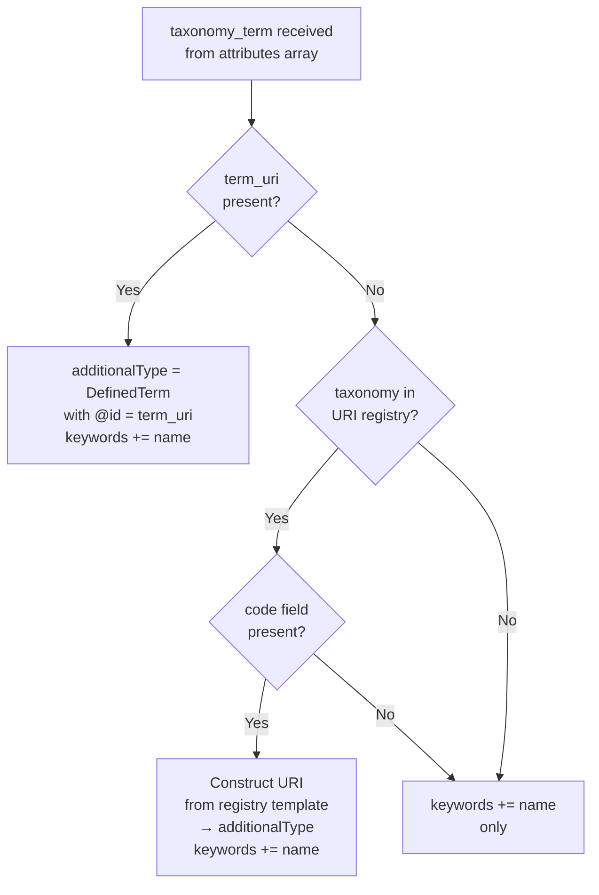
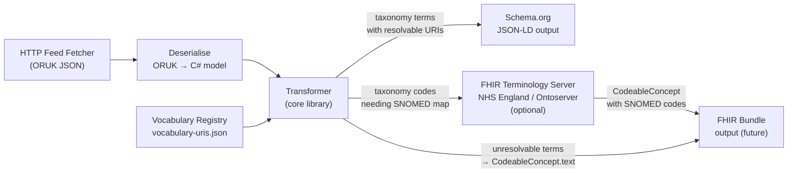
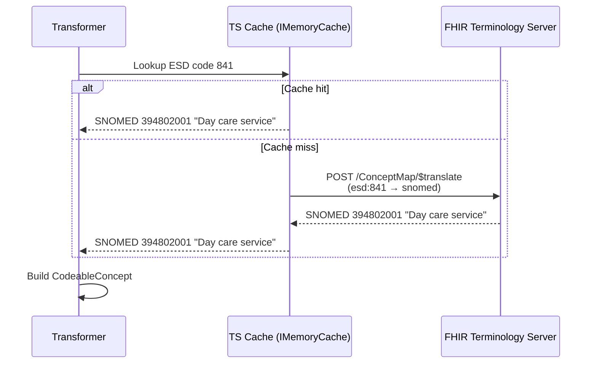
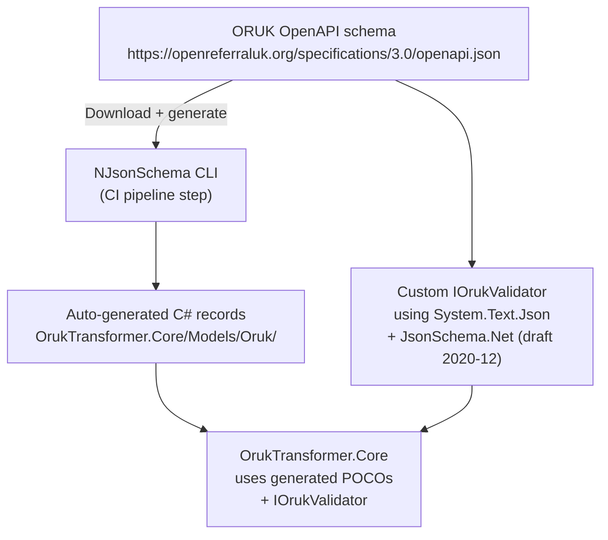
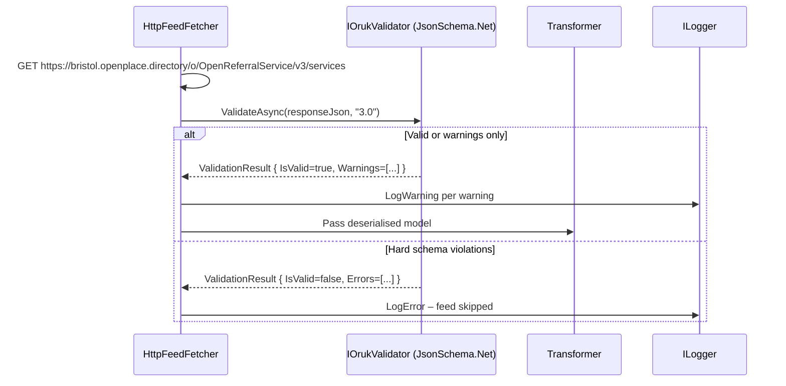

# Terminology and Vocabulary Mapping

This document analyses the vocabulary and terminology challenges that arise when transforming Open Referral UK (ORUK) service-directory data into Schema.org JSON-LD and (in future) HL7 FHIR `HealthcareService` resources.

The Bristol Open Place Directory feed at `https://bristol.openplace.directory/o/OpenReferralService/v3` is used as a reference throughout, as a real-world ORUK v3 implementation powered by Placecube's Open Place Directory platform.

---

## 1. The Vocabulary Landscape

Three distinct vocabulary layers must be aligned in this transformation pipeline:



---

## 2. ORUK v3 Taxonomy Data Structure

In ORUK v3 (built on HSDS 3.x), taxonomy classification is applied to services through an `attributes` array.  Each attribute carries a nested `taxonomy_term` object:

```json
{
  "attributes": [
    {
      "id": "ae58cc39-8b70-4ab1-8aea-786882e5ac8e",
      "link_type": "taxonomy",
      "taxonomy_term": {
        "id": "3f7b145d-84af-42d7-8fae-eaca714b02b2",
        "name": "Community Counselling",
        "description": "Counselling and mental health support services",
        "parent_id": "0bc248fa-dc27-4650-9ba4-8f1a24ef16a2",
        "taxonomy": "esdstandards",
        "term_uri": "https://standards.esd.org.uk/?uri=esd%3Aservice%2F1281",
        "term": "Community Counselling"
      }
    }
  ]
}
```

The taxonomy terms themselves are also addressable via `GET /taxonomy_terms` and the parent `Taxonomy` object via `GET /taxonomies`:

```json
{
  "id": "5c4d79d7-cc55-470e-9f1f-8cad074e4892",
  "name": "ESD Standards",
  "description": "LGA / ESD service directory taxonomy",
  "uri": "https://standards.esd.org.uk/",
  "version": "2024",
  "taxonomy_terms": [
    {
      "id": "3f7b145d-84af-42d7-8fae-eaca714b02b2",
      "name": "Community Counselling",
      "taxonomy": "esdstandards",
      "term_uri": "https://standards.esd.org.uk/?uri=esd%3Aservice%2F1281",
      "term": "Community Counselling"
    }
  ]
}
```

### Key Fields

| Field | Description |
|-------|-------------|
| `id` | Local UUID for the term |
| `name` | Human-readable label |
| `description` | Optional description |
| `parent_id` | UUID of parent term (hierarchical vocabulary) |
| `taxonomy` | **String identifying the scheme** (e.g. `"esdstandards"`, `"snomed"`, `"local"`) — free text, no controlled list |
| `term_uri` | **Resolvable URI for the concept** — most valuable field for machine-readable output |
| `term` | Duplicate of `name` in most implementations |

> **Note on field naming:** The ORUK v3 schema uses `taxonomy` (not `vocabulary`) to identify the scheme.  The parent `Taxonomy` object carries a `uri` that can serve as the namespace for terms lacking a `term_uri`.

---

## 3. Three Vocabulary Types in Practice

### Type A – ESD / LGA Service List (✅ Good practice)

Bristol's Open Place Directory (powered by Placecube) and other iStandUK-accredited directories publish taxonomy terms aligned to the [LG Inform Plus / ESD Standards vocabulary](https://standards.esd.org.uk/).  These are highly interoperable because they carry a resolvable `term_uri`:

```json
{
  "id": "a1b2c3d4-...",
  "name": "Day Opportunities",
  "taxonomy": "esdstandards",
  "term_uri": "https://standards.esd.org.uk/?uri=esd%3Aservice%2F841",
  "parent_id": null
}
```

**Transformer action:** use `term_uri` directly as `additionalType`.

**Schema.org output:**
```json
{
  "@type": "GovernmentService",
  "additionalType": {
    "@type": "DefinedTerm",
    "@id": "https://standards.esd.org.uk/?uri=esd%3Aservice%2F841",
    "name": "Day Opportunities",
    "inDefinedTermSet": "https://standards.esd.org.uk/"
  },
  "keywords": "Day Opportunities"
}
```

### Type B – SNOMED CT (✅ Good practice for health services)

NHS-aligned feeds covering healthcare services may include SNOMED CT codes:

```json
{
  "id": "d4e5f6a7-...",
  "name": "Mental health counselling service",
  "taxonomy": "snomed",
  "term_uri": "http://snomed.info/sct/394914008",
  "parent_id": null
}
```

SNOMED CT URIs are resolvable via the NHS terminology browser and usable directly as `additionalType` in Schema.org **and** as `CodeableConcept.coding` in FHIR — this is the only vocabulary that bridges both output formats without a crosswalk.

### Type C – Local / custom vocabulary (⚠️ Common, problematic)

Many real-world feeds, including Bristol's, carry terms in a local or platform-specific taxonomy.  The `taxonomy` field may be `"local"`, a platform name, or entirely absent:

```json
{
  "id": "ghi789ab-...",
  "name": "Community lunch club",
  "taxonomy": "placecube_local",
  "term_uri": null,
  "parent_id": "parent-uuid"
}
```

No machine-readable, resolvable code exists.  The name can only be used as a `keywords` string; it cannot be bound to a FHIR `CodeableConcept` without a manually curated crosswalk.

---

## 4. Issues Observed in Bristol and Similar Feeds

### Issue 1 — Missing `term_uri` despite a known taxonomy

Some Bristol records include a recognisable `taxonomy` value (e.g. `"esdstandards"`) but leave `term_uri` null, typically when the service was migrated from an older data format.  The transformer must attempt URI reconstruction:

| `taxonomy` value (normalised) | Base URI template |
|-------------------------------|------------------|
| `esdstandards` | `https://standards.esd.org.uk/?uri=esd%3Aservice%2F{code}` |
| `snomed` / `snomed ct` | `http://snomed.info/sct/{code}` |
| `loinc` | `http://loinc.org/{code}` |
| `icd-10` | `http://hl7.org/fhir/sid/icd-10/{code}` |

This requires a separate `code` field to be populated.  If neither `term_uri` nor `code` is present, the term degrades to `keywords` only.

### Issue 2 — Inconsistent capitalisation of `taxonomy` value

Bristol and other Placecube feeds have been observed using `"ESDstandards"`, `"esdstandards"`, and `"ESD Standards"` for the same scheme across different records.  The transformer must normalise (lower-case, trim) before registry lookup.

### Issue 3 — Taxonomy hierarchy depth

Bristol's Open Place Directory uses a multi-level hierarchy (up to 4 levels).  ORUK exposes this through `parent_id` chains.  Schema.org has no standard mechanism for expressing a classified hierarchy; the transformer should traverse the chain and emit a breadcrumb path as the `keywords` value:

```
"Health > Mental Health > Counselling > Cognitive Behavioural Therapy"
```

### Issue 4 — Multiple taxonomies per service

A single service on Bristol's feed may carry both:
- An ESD term (broad national category)
- A local Placecube term (operational subcategory specific to Bristol)

Both should be emitted — ESD terms as `additionalType` with URI, local terms appended to `keywords`.

### Issue 5 — Absent taxonomy on some attributes

Some `attributes` entries carry only `link_type` and a minimal `taxonomy_term` with no `term_uri` and a generic `name`.  These should be silently skipped for `additionalType` and included in `keywords` only if the name is meaningful (non-empty, non-generic).

---

## 5. Schema.org Vocabulary Mapping Strategy

### 5.1 Decision Tree



### 5.2 Vocabulary-to-URI Registry

A configuration file (`vocabulary-uris.json`) loaded at startup maps known `taxonomy` strings to URI templates.  Keys are matched case-insensitively after trimming:

```json
{
  "esdstandards":   "https://standards.esd.org.uk/?uri=esd%3Aservice%2F{code}",
  "esd standards":  "https://standards.esd.org.uk/?uri=esd%3Aservice%2F{code}",
  "snomed":         "http://snomed.info/sct/{code}",
  "snomed ct":      "http://snomed.info/sct/{code}",
  "loinc":          "http://loinc.org/{code}",
  "icd-10":         "http://hl7.org/fhir/sid/icd-10/{code}"
}
```

### 5.3 DefinedTerm Pattern

When a URI exists but is not a Schema.org type URL, emit a `DefinedTerm` node:

```json
{
  "additionalType": {
    "@type": "DefinedTerm",
    "@id": "https://standards.esd.org.uk/?uri=esd%3Aservice%2F841",
    "name": "Day Opportunities",
    "inDefinedTermSet": "https://standards.esd.org.uk/"
  }
}
```

---

## 6. FHIR HealthcareService – Vocabulary Mapping Issues

### 6.1 FHIR Coding Requirements

FHIR `HealthcareService.category` and `HealthcareService.type` use `CodeableConcept`, each containing one or more `Coding` objects.  Each `Coding` must carry:

- `system` — canonical code system URI (e.g. `http://snomed.info/sct`)
- `code` — the code value
- `display` — human-readable label

The [UK Core `HealthcareService`](https://simplifier.net/hl7fhirukcorer4/ukccore-healthcareservice) profile binds `category` to a SNOMED CT ValueSet.  This means that ESD codes and local terms **cannot be directly used** in a conformant FHIR resource without a crosswalk.

### 6.2 Crosswalk Challenges

| ORUK taxonomy | FHIR path | Crosswalk difficulty |
|---------------|-----------|----------------------|
| `snomed` with `term_uri` | `CodeableConcept.coding` (system=`http://snomed.info/sct`) | ✅ Trivial — use code directly. |
| `esdstandards` with code | `HealthcareService.category` | ⚠️ No published ESD→SNOMED ConceptMap; partial coverage via NHS Data Dictionary. |
| Local / custom | None | ❌ Cannot map without human curation. |
| Any term (name only) | `CodeableConcept.text` | ⚠️ Legal in FHIR but non-interoperable. |

FHIR permits a `CodeableConcept` to carry both a `coding` array (for interoperability) and a plain `text` field (for human readability).  Where a SNOMED code is unavailable, the `text` field alone is populated:

```json
{
  "category": [
    {
      "coding": [
        {
          "system": "http://snomed.info/sct",
          "code": "394914008",
          "display": "Mental health care service"
        }
      ],
      "text": "Community Counselling"
    }
  ]
}
```

---

## 7. FHIR Terminology Server – Role in the Architecture

### 7.1 What a Terminology Server Provides

A FHIR Terminology Server (TS) exposes the standard FHIR Terminology Service API (`$expand`, `$lookup`, `$validate-code`, `$translate`, `$closure`) over code systems such as SNOMED CT and custom ValueSets.

**NHS England operates a FHIR Terminology Server** built on [CSIRO Ontoserver](https://ontoserver.csiro.au/), available at:

- `https://ontology.nhs.uk/production1/fhir/` (production, requires NHS network / API key)
- `https://r4.ontoserver.csiro.au/fhir/` (public CSIRO demo — for development and testing)

### 7.2 Operations Relevant to This Project

| FHIR Operation | Use in This Project |
|----------------|---------------------|
| `GET /CodeSystem/$lookup?system=http://snomed.info/sct&code=394914008` | Validate a SNOMED code and retrieve its display label before emitting it in FHIR output. |
| `POST /ConceptMap/$translate` | Translate an ESD code to a SNOMED CT equivalent (where a ConceptMap exists). |
| `GET /ValueSet/$expand?url=https://fhir.nhs.uk/ValueSet/UKCore-PracticeSettingCode` | Enumerate valid codes for `HealthcareService.specialty` to validate or suggest mappings. |
| `GET /ValueSet/$validate-code` | Confirm a code is valid within the UK Core ValueSet before writing to FHIR output. |

### 7.3 Architecture with Terminology Server

The terminology server is an **optional, enrichment-phase** component consulted only when producing FHIR output.  For Schema.org output it is not needed.



### 7.4 Terminology Server Integration Design

- The TS client should be behind an `ITerminologyClient` interface for testability and graceful degradation.
- Responses should be cached aggressively via `IMemoryCache` with a configurable TTL (e.g. 24 h) — code meanings do not change frequently.
- If the TS is unavailable or slow, the transformer degrades gracefully: the `coding` array is omitted and `CodeableConcept.text` is used alone.
- For Schema.org output the TS is not invoked — URI construction from the vocabulary registry is sufficient.



### 7.5 Recommended Terminology Server Options

| Option | Availability | Notes |
|--------|-------------|-------|
| **NHS England Ontoserver** (`ontology.nhs.uk`) | NHS network / API key | Full UK SNOMED CT; authoritative for UK production use. |
| **CSIRO public demo** (`r4.ontoserver.csiro.au`) | Public internet | Suitable for development and CI; not for production. |
| **HAPI FHIR server** (self-hosted) | Self-hosted | Full control; requires importing SNOMED CT release files (licence required). |
| **HL7 reference server** (`tx.fhir.org`) | Public internet | Broad terminology support; limited UK-specific content. |

---

## 8. ORUK Validator – NuGet Package Assessment

### 8.1 What the Validator Contains

The `OpenReferralUK/oruk-validator` repository is a **.NET 10 / C# 13+ ASP.NET Core application** with three projects:

| Project | Description |
|---------|-------------|
| `OpenReferralApi` | Main web API, controllers, health checks, DI wiring |
| `OpenReferralApi.Core` | Core business logic and services (see below) |
| `OpenReferralApi.Tests` | Unit and integration tests |

The **`OpenReferralApi.Core`** library contains:

- Validation-related **C# models** (`ValidationResult`, `OpenApiValidationResult`, `SchemaValidationDetail`, etc.) — these are validation-infrastructure models, **not** ORUK entity POCOs.
- `IJsonValidatorService` / `JsonValidatorService` — validates raw JSON payloads against the ORUK JSON Schema using **`Newtonsoft.Json.Schema 4.0.1`**.
- `SchemaResolverService` / `RemoteSchemaLoader` — fetches and caches the ORUK JSON Schema files from `https://openreferraluk.org/specifications/` at startup.
- Supporting services for OpenAPI spec parsing, endpoint discovery, feed management, and observability.

Critically, the validator **does not contain typed C# record/class models for ORUK data entities** (Service, Organization, Location, etc.).  It validates raw JSON against JSON Schema rather than deserialising into a typed object graph.

### 8.2 What Is and Isn't Extractable

| Component | Extractable as NuGet? | Notes |
|-----------|-----------------------|-------|
| `IJsonValidatorService` + `JsonValidatorService` | ⚠️ Possible but not adopted | Uses `Newtonsoft.Json.Schema`; this project uses `System.Text.Json` exclusively. |
| `SchemaResolverService` + `RemoteSchemaLoader` | ⚠️ Possible but not adopted | As above — Newtonsoft dependency. |
| `ValidationResult` and related models | ✅ Models only | Could be extracted with no Newtonsoft dependency. |
| Typed ORUK entity POCOs | ❌ Not present | Must be generated from the published OpenAPI schema (see §8.4). |
| MongoDB integration | ❌ Not needed | Feed-registry storage — not relevant to the transformer. |
| OpenAPI validation logic | ❌ Not needed | Validates API specs, not feed data. |

### 8.3 Policy: No Refactoring of the Validator

**This project will not fork or refactor `OpenReferralUK/oruk-validator`.**

Although both projects now target **.NET 10**, the validator's core validation logic depends on `Newtonsoft.Json.Schema` for JSON Schema evaluation.  This project uses `System.Text.Json` exclusively (see copilot-instructions.md).  Introducing a `Newtonsoft.Json` dependency would conflict with this principle and add unnecessary complexity.

The validator is a separate, independently maintained tool.  It should continue to be used as-is for its intended purpose (validating ORUK feed endpoints via its own API), not as a library component inside this transformer.

### 8.4 Recommended Path Forward



**Implementation approach:**

1. **ORUK entity POCOs** — use `NJsonSchema.CodeGeneration.CSharp` to generate `record` types from `https://openreferraluk.org/specifications/3.0/openapi.json`.  Automate regeneration in CI so models always track the current schema version.
2. **Feed-response validation** — implement `IOrukValidator` / `OrukSchemaValidator` using [`JsonSchema.Net`](https://docs.json-everything.net/schema/basics/) (a `System.Text.Json`-native JSON Schema library supporting draft 2020-12).  This replicates the validator's schema-checking behaviour without the `Newtonsoft.Json.Schema` dependency.
3. **Upstream engagement** — raise a GitHub issue on `OpenReferralUK/oruk-validator` proposing extraction of a minimal `OpenReferralUK.Models` NuGet package (POCOs only, no Newtonsoft) to improve ecosystem interoperability.  This is a community contribution opportunity, not a blocker.

### 8.5 Validation Integration Pattern



---

## 9. Summary of Vocabulary Issues and Mitigations

| Issue | Severity | Mitigation |
|-------|----------|------------|
| Local / custom `taxonomy` with no `term_uri` | High | Degrade to `keywords` in Schema.org; omit `CodeableConcept.coding` in FHIR |
| Inconsistent capitalisation of `taxonomy` field | Medium | Normalise lower-case + trim before registry lookup |
| Known `taxonomy` but missing `term_uri` and `code` | Medium | Log warning; emit `keywords` only |
| No ESD → SNOMED crosswalk | High | Use FHIR TS `$translate` where a ConceptMap exists; otherwise `text` only |
| Multi-level `parent_id` hierarchy lost in Schema.org | Low | Emit delimited breadcrumb path in `keywords` |
| Multiple taxonomies per service (ESD + local) | Low | Emit all ESD terms as `additionalType`; local terms as `keywords` |
| FHIR ValueSet binding failures | Medium | Validate with TS `$validate-code` before writing; fall back to `text` |
| Validator uses Newtonsoft.Json.Schema — not adopted | Medium | Implement `IOrukValidator` using `JsonSchema.Net` (System.Text.Json-native); validator will not be refactored |

---

## 10. References

- ORUK v3 OpenAPI schema: <https://openreferraluk.org/specifications/3.0/openapi.json>
- ORUK taxonomy and attributes: <https://docs.openreferral.org/en/v3.0/hsds/classifications.html>
- ESD Standards vocabulary browser: <https://standards.esd.org.uk/>
- LG Inform Plus service list: <https://schemas.opendata.esd.org.uk/ServiceDirectory>
- SNOMED CT UK browser: <https://termbrowser.nhs.uk/>
- NHS England Ontoserver: <https://digital.nhs.uk/services/terminology-server>
- CSIRO Ontoserver documentation: <https://ontoserver.csiro.au/docs/introduction/>
- HL7 FHIR ConceptMap `$translate`: <https://hl7.org/fhir/R4/conceptmap-operation-translate.html>
- UK Core HealthcareService profile: <https://simplifier.net/hl7fhirukcorer4/ukccore-healthcareservice>
- OpenReferralUK oruk-validator (GitHub): <https://github.com/OpenReferralUK/oruk-validator>
- NJsonSchema code generation: <https://github.com/RicoSuter/NJsonSchema>
- JsonSchema.Net (System.Text.Json-native JSON Schema): <https://docs.json-everything.net/schema/basics/>
- Bristol Open Place Directory: <https://bristol.openplace.directory/o/OpenReferralService/v3>
