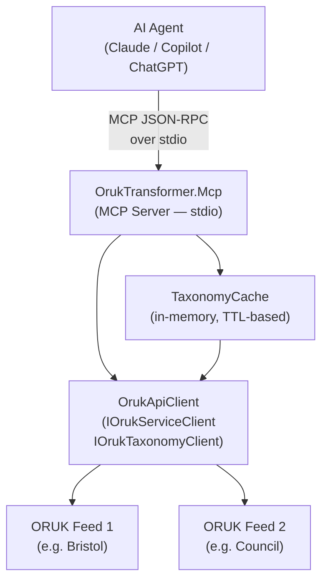

# OrukTransformer.Mcp

An [MCP (Model Context Protocol)](https://modelcontextprotocol.io/) server that allows AI agents — such as GitHub Copilot, Claude, and ChatGPT — to query live [Open Referral UK](https://openreferraluk.org/) service directories using natural language.

## Overview

This project implements an MCP server using the [official C# MCP SDK](https://github.com/modelcontextprotocol/csharp-sdk). It exposes thirteen tools that an AI agent can call to help a user find community services, understand eligibility, and get location and contact details.

## MCP Tools

| Tool | Description |
|------|-------------|
| `search_services` | Search across all configured ORUK feeds with keyword, location, age, and cost filters. |
| `get_service_detail` | Retrieve full details (opening times, accessibility, eligibility, cost) for a specific service. |
| `get_service_schedule` | Get the opening hours and availability schedule for a specific service. |
| `get_required_documents` | Get what a person needs to access a service — documents, application process, eligibility. |
| `list_feeds` | List the configured ORUK data source feeds. |
| `list_taxonomy_terms` | Browse the taxonomy categories used by a feed. |
| `resolve_taxonomy_label` | Translate a plain-language phrase into taxonomy term IDs. |
| `get_services_by_language` | Find services delivered in a specific language (e.g. Welsh, Polish, BSL, Arabic). |
| `find_accessible_services` | Find services with a specific accessibility feature (e.g. wheelchair access, hearing loop). |
| `find_services_by_delivery_type` | Find services filtered by delivery type: physical, virtual (online/phone), or postal. |
| `get_services_updated_since` | Find services added or updated since a given date — useful for monitoring new provision. |
| `search_organisations` | Search for organisations (charities, councils, NHS bodies) that deliver services. |
| `get_organisation_detail` | Full profile of an organisation — description, contacts, website, legal status, services. |

## Running in Development (stdio)

### Prerequisites

- .NET 10 SDK
- An ORUK v3 API endpoint (e.g. [Bristol Open Place Directory](https://bristol.openplace.directory/))

### Configuration

1. Edit `feeds.json` at the repository root to list the ORUK endpoints to query and provide friendly names:

```json
[
  {
    "url": "https://bristol.openplace.directory/o/OpenReferralService/v3",
    "name": "Bristol",
    "aliases": ["bristol"]
  }
]
```

`aliases` are optional short names that can be used in `feedUrl` parameters instead of full URLs.

2. Optionally adjust `appsettings.json`:

```json
{
  "Mcp": {
    "MaxResultsPerQuery": 20,
    "TaxonomyCacheTtlMinutes": 60
  }
}
```

### Start the server

```bash
dotnet run --project src/OrukTransformer.Mcp
```

The server communicates over **stdin/stdout** using the MCP JSON-RPC protocol. Logs are written to **stderr** so they do not interfere with the protocol.

### Configure Claude Desktop

Add to `claude_desktop_config.json` (`%APPDATA%\Claude\claude_desktop_config.json` on Windows):

```json
{
  "mcpServers": {
    "oruk": {
      "command": "dotnet",
      "args": [
        "run",
        "--project",
        "C:\\path\\to\\ORUK-AlternativeRepresentations\\src\\OrukTransformer.Mcp"
      ]
    }
  }
}
```

Or point at the compiled executable:

```json
{
  "mcpServers": {
    "oruk": {
      "command": "C:\\path\\to\\OrukTransformer.Mcp.exe"
    }
  }
}
```

### Test with MCP Inspector

```bash
npx @modelcontextprotocol/inspector dotnet run --project src/OrukTransformer.Mcp
```

## Project Structure

```
OrukTransformer.Mcp/
├── Program.cs                  # Host setup, DI wiring, MCP server startup
├── McpOptions.cs               # Configuration options (bound from appsettings.json)
├── appsettings.json            # Default configuration
├── Config/
│   └── FeedsLoader.cs          # Parses feeds.json into feed definitions with labels/aliases
├── Models/
│   └── ServiceWithOrigin.cs    # Internal record wrapping a service with its feed URL
├── Taxonomy/
│   ├── ITaxonomyCache.cs       # Caching interface for taxonomy terms
│   └── TaxonomyCache.cs        # TTL-based in-memory taxonomy cache
└── Tools/
    ├── OrukServiceSearchTool.cs       # search_services MCP tool
    ├── OrukServiceDetailTool.cs       # get_service_detail MCP tool
    ├── OrukTaxonomyTool.cs            # list_taxonomy_terms / resolve_taxonomy_label tools
    ├── OrukFeedInfoTool.cs            # list_feeds MCP tool
    ├── OrukScheduleTool.cs            # get_service_schedule MCP tool
    ├── OrukRequiredDocumentsTool.cs   # get_required_documents MCP tool
    ├── OrukServiceFilterTool.cs       # get_services_by_language / find_accessible_services / find_services_by_delivery_type
    ├── OrukRecentlyUpdatedTool.cs     # get_services_updated_since MCP tool
    └── OrukOrganizationTool.cs        # search_organisations / get_organisation_detail MCP tools
```

## Dependencies

| Package | Purpose |
|---------|---------|
| `ModelContextProtocol` 1.2.0 | Official C# MCP SDK |
| `Microsoft.Extensions.Hosting` 10.x | Generic host, DI, configuration |
| `OrukApiClient` (project ref) | ORUK HTTP client with pagination and filtering |
| `OrukModels` (project ref) | ORUK v3 entity model classes |

## Architecture



## Roadmap

- [ ] HTTP/SSE transport for hosted deployment
- [ ] Multi-feed result ranking and deduplication improvements
- [ ] Postcode-to-coordinates geocoding for proximity search
- [ ] Streaming results via MCP resource subscriptions
